# Task Tracker Architecture

A markdown-based personal task management system with daily standups, weekly reviews, and automated priority escalation. All data lives in plain markdown files — no database, no server.

---

## System Overview


---

## Data Flow

End-to-end flow from task creation through archival:


---

## Module Dependency Graph


**All modules use Python stdlib only — zero external dependencies.**

---

## Task Lifecycle


---

## Priority Escalation

Display-only escalation — the task file is never mutated. Overdue tasks are visually promoted in standup and review output.

```mermaid
flowchart TD
    START{"Check overdue<br/>open tasks"} --> Q2CHECK{"Q2 🟡 task<br/>overdue?"}
    START --> Q3CHECK{"Q3 🟠 task<br/>overdue?"}

    Q2CHECK -->|">3 days"| Q2_TO_Q3["Display as Q3 🟠<br/>⬆️ escalated from 🟡"]
    Q2CHECK -->|">7 days"| Q2_TO_Q1["Display as Q1 🔴<br/>⬆️ escalated from 🟡"]
    Q2CHECK -->|"≤3 days"| Q2_SAME["Stays Q2 🟡"]

    Q3CHECK -->|">14 days"| Q3_TO_Q1["Display as Q1 🔴<br/>⬆️ escalated from 🟠"]
    Q3CHECK -->|"≤14 days"| Q3_SAME["Stays Q3 🟠"]

    style Q2_TO_Q1 fill:#ff6b6b,color:#000
    style Q3_TO_Q1 fill:#ff6b6b,color:#000
    style Q2_TO_Q3 fill:#ffa500,color:#000
```



**Implementation:** `utils.effective_priority()` computes escalated priority on read. `utils.regroup_by_effective_priority()` creates shallow copies with escalation indicators for display.

---

## Daily Standup Flow


---

## CLI Commands

### tasks.py

| Command | Flags | Description |
|---------|-------|-------------|
| `list` | `--priority high\|medium\|low` | Filter by priority |
| | `--status open\|done` | Filter by status |
| | `--due today\|this-week\|overdue\|due-or-overdue` | Filter by deadline |
| | `--completed-since 24h\|7d\|30d` | Recently completed |
| `add "title"` | `--priority high\|medium\|low` | Set priority |
| | `--due YYYY-MM-DD` | Set due date |
| | `--owner NAME` | Assign owner |
| | `--area CATEGORY` | Set area/category |
| `done "query"` | | Fuzzy-match and complete a task |
| `blockers` | `--person NAME` | Show blocking tasks |
| `archive` | | Archive done tasks to quarterly file |

**Global flag:** `--personal` switches from Work to Personal task file.

### standup.py / personal_standup.py

| Flag | Description |
|------|-------------|
| `--date YYYY-MM-DD` | Standup for specific date (default: today) |
| `--json` | Output as JSON dict |
| `--split` | Split into 3 messages (completed / calendar / todos) |
| `--skip-missed` | Omit missed tasks section |

### weekly_review.py

| Flag | Description |
|------|-------------|
| `--week YYYY-WNN` | ISO week to review (default: current) |
| `--archive` | Archive completions to quarterly file |

### extract_tasks.py

| Flag | Description |
|------|-------------|
| `--from-text TEXT` | Parse meeting notes from string |
| `--from-file PATH` | Parse meeting notes from file |
| `--llm` | Use LLM prompt instead of local regex |

---

## Environment Variables

| Variable | Default | Purpose |
|----------|---------|---------|
| `TASK_TRACKER_WORK_FILE` | `~/Obsidian/03-Areas/Work/Work Tasks.md` | Path to work task board |
| `TASK_TRACKER_PERSONAL_FILE` | `~/Obsidian/03-Areas/Personal/Personal Tasks.md` | Path to personal task board |
| `TASK_TRACKER_LEGACY_FILE` | `~/clawd/memory/work/TASKS.md` | Fallback if Obsidian file missing |
| `TASK_TRACKER_ARCHIVE_DIR` | `~/clawd/memory/work` | Directory for quarterly archives |
| `TASK_TRACKER_DAILY_NOTES_DIR` | *(unset — disables completion tracking)* | Directory with `YYYY-MM-DD.md` daily notes |
| `TASK_TRACKER_DONE_LOG_DIR` | *(falls back to DAILY_NOTES_DIR)* | Override directory for completion logs |
| `TASK_TRACKER_DEFAULT_OWNER` | `me` | Default owner for new tasks |
| `STANDUP_CALENDARS` | *(unset — disables calendar)* | JSON config for calendar sources |

---

## File I/O Map

| Script | Reads | Writes |
|--------|-------|--------|
| `tasks.py list` | Task board | — |
| `tasks.py add` | Task board | Task board (insert line) |
| `tasks.py done` | Task board, daily notes | Task board (remove/update line), daily note (append) |
| `tasks.py archive` | Daily notes | Quarterly archive |
| `standup.py` | Task board, daily notes, calendar | — |
| `personal_standup.py` | Task board, daily notes, calendar | — |
| `weekly_review.py` | Task board, daily notes, archive | Quarterly archive (if `--archive`) |
| `log_done.py` | — | Daily note (append only) |
| `daily_notes.py` | Daily notes | — |
| `extract_tasks.py` | Meeting notes (text/file) | — (stdout) |

**Key properties:**
- `log_done.py` is append-only — never overwrites existing data
- Archive operations are idempotent — skip entries already present
- Priority escalation is read-only — task files are never mutated for display

---

## Integration Points

### Calendar (gog CLI)

`standup_common.py` calls `gog calendar list <calendar_id> --account <account> --today --json` for each configured calendar. Configured via `STANDUP_CALENDARS` env var (JSON object keyed by label). Silently skipped if `gog` is unavailable or config is unset.

### Telegram (task-shortcuts.sh)

Bash wrapper that runs standup/review scripts and formats output for Telegram delivery via OpenClaw. The `--split` flag separates output into 3 messages using `___SPLIT_MESSAGE___` delimiters.

| Shortcut | Maps to |
|----------|---------|
| `daily` | `standup.py --split` |
| `weekly` | `weekly_review.py` |
| `done24h` | `tasks.py list --completed-since 24h` |
| `done7d` | `tasks.py list --completed-since 7d` |

### Obsidian (Dataview)

Task files use Obsidian-compatible inline fields (`area::`, `owner::`, `🗓️YYYY-MM-DD`) that work with Dataview queries. See [SKILL.md](../SKILL.md) for example queries.

### Task Format

```markdown
- [ ] **Task title** 🗓️2026-01-22 area:: Sales owner:: Sarah recur:: weekly
```

Supported inline fields: `area::`, `goal::`, `owner::`, `blocks::`, `type::`, `recur::`, `estimate::`, `depends::`, `sprint::`.
