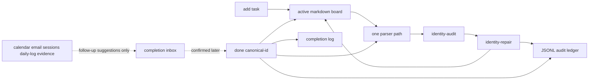

# refactor: split PR 108 into canonical identity kernel

## Summary

Rescope the existing PR #108 into a first mergeable slice, referred to below as #108A, that contains only the canonical task identity kernel: inline `task_id::` generation, read-only identity audit, safe metadata repair, ID-only `done`, and a minimal JSONL audit ledger for repair and completion. Move completion candidates, broad state transitions, fuzzy ingestion, weekly/EOD workflow migration, and calendar/Gmail/session evidence into follow-up PRs after the core parser and mutation boundary is stable.

**Target repo:** task-tracker-openclaw-skill. Unless explicitly prefixed with another repo alias, paths in this plan are relative to this repo.

---

## Problem Frame

The current PR has the right architectural center but the wrong blast radius. It mixes the new identity and ledger kernel with workflow migration, candidate lifecycle, state commands, docs expansion, and legacy compatibility cleanup across 24 files. That is why each review cycle finds another edge case: the PR is asking reviewers to validate a new source-of-truth boundary while old parser, fuzzy matching, state, and workflow surfaces are still active in the same change.

The broader product requirements still stand: active-board markdown owns editable current tasks, the ledger owns lifecycle and evidence history, and unsafe title/list-position mutations must stop. This plan narrows the first implementation slice so those requirements can land without pretending the rest of vNext is complete.

---

## Requirements

- R1. PR #108A must preserve the hybrid owner contract: board markdown is current task state; JSONL is audit history, not replayed source of truth.
- R2. New tasks and repaired active tasks must receive durable inline `task_id::` metadata that survives title edits, section moves, and reorder.
- R3. `identity-audit` must be read-only and report missing IDs, duplicate IDs, malformed IDs, ambiguous repairs, and missing task files without writing.
- R4. `identity-repair --apply` may write only safe missing `task_id::` metadata and one repair ledger event per changed task; it must block ambiguous or invalid state without board writes.
- R5. `done <task_id>` must be the only active mutation shipped in #108A; title, list-position, parse-order, and fuzzy mutations must block or remain read-only diagnostics.
- R6. A direct ID-based `done` must write a minimal state-transition ledger event and keep the board, daily completion log, and ledger consistent on failure.
- R7. Recurring task completion must either update the due marker deterministically or remove the task when recurrence is invalid, with test coverage.
- R8. Public docs and command help must describe only the safe kernel in #108A; deferred features must not be advertised as production-ready.
- R9. Completion candidates, external evidence, broad state transitions, backlog/delegation/drop, weekly summary primitives, calendar lifecycle, and fuzzy daily-log mutation must be deferred to follow-up PRs.

**Origin actors:** User, Niemand-work agent, task automation, planner/implementer agent.

**Origin flows preserved in #108A:** unsafe action block and direct ID-based DONE.

**Origin flows deferred:** morning standup caps, EOD completion inbox, weekly active-board cleanup, frozen-task review, calendar/Gmail/session candidates.

**Origin acceptance examples covered by #108A:** read-only audit and repair split, direct ID-based DONE, ambiguous title block, reorder-safe canonical ID actions.

---

## Scope Boundaries

- Do not land PR #108 as the full vNext workflow migration.
- Do not make the ledger the current-state database in this slice.
- Do not add or keep candidate inbox commands in #108A.
- Do not keep broad `state delegate`, `state backlog`, `state drop`, or similar lifecycle transitions in #108A unless they are removed from the public surface and tests.
- Do not include fuzzy daily-log ingestion as a mutation path.
- Do not update Lobster cron workflows in #108A. The first task-tracker PR should define the safe kernel that those workflows can consume later.
- Do not silently skip malformed ledger history in any path that claims to audit lifecycle completeness.

### Deferred to Follow-Up Work

- PR #108B: consolidate parser and mutation boundaries around one `TaskRecord` contract and remove duplicate task-line mutation helpers.
- PR #108C: reintroduce completion evidence as an inbox that creates suggestions only and applies confirmed items through ID-only `done`.
- PR #108D: wire the existing completion inbox into standup, EOD, Telegram, and
  Lobster workflows after extracting shared evidence matching and clarifying
  candidate JSON confirmability semantics.
- Later ingestion PR: add Gmail, calendar, session-log, and other noisy evidence
  sources only after the workflow-consumption loop is proven.
- Later product slice: weekly disposition, frozen tasks, delegated/backlog first-class states, and capped daily/EOD UX.

---

## Context & Research

### Relevant Code and Patterns

- `scripts/task_identity.py` already contains the core shape for `IdentityRecord`, active-record filtering, `identity-audit`, duplicate-ID detection, missing-ID proposals, and parking-lot exclusion.
- `scripts/task_repair.py` already separates dry-run and apply, blocks duplicate or malformed identity state, writes repair events, and restores board/ledger snapshots on append failure.
- `scripts/task_ledger.py` is the JSONL append path. It is good enough for append-only repair and done events, but its reader should not silently erase malformed history in audit-sensitive paths.
- `scripts/task_transitions.py` contains `complete_by_id` plus broader lifecycle transitions. #108A should keep the completion kernel and recurrence behavior while cutting or hiding non-done state transitions.
- `scripts/tasks.py` is both legacy CLI and new orchestration layer. The plan should reduce its new public command surface for #108A to `add`, `done`, `identity-audit`, and `identity-repair`.
- `scripts/utils.py` is the existing board parser. It should continue parsing `task_id::` and legacy `id::` consistently instead of creating a second parser in the kernel slice.
- `tests/test_task_identity.py`, `tests/test_metadata_repair.py`, `tests/test_task_transitions.py`, `tests/test_tasks.py`, and `tests/test_objective_parser.py` already hold most #108A regression coverage.
- `tests/test_completion_candidates.py`, candidate commands, and candidate docs belong to the follow-up evidence inbox PR, not the first kernel PR.

### Institutional Learnings

- The task-tracker vNext requirements in `lobster-workflows:docs/brainstorms/2026-05-20-task-tracker-vnext-requirements.md` define the hybrid owner model, the read-only audit versus metadata repair split, and the ban on title/list-position mutations.
- The diagnosis in `lobster-workflows:docs/debug/2026-05-20-task-tracker-ux-failures.md` identifies weak identity, missed DONEs, stale carryover, and noisy standups as source-of-truth failures rather than isolated bugs.
- The ideation in `lobster-workflows:docs/ideation/2026-05-20-task-tracker-radical-simplification-ideas.md` ranks canonical identity, an idempotent DONE pipeline, and canonical standup IDs as the first simplification moves.
- Oracle's architecture review of PR #108 recommends landing only a reduced identity kernel, then consolidating parser boundaries, then reintroducing evidence inbox behavior.

### External References

- No external research is needed for this plan. The risk is local architecture scope, not unknown third-party APIs or framework behavior.

---

## Key Technical Decisions

- Split before merge: shrink the current PR into a kernel rather than continuing the review loop on the full 24-file surface.
- Keep board markdown as current state for now. The ledger records repair and completion history, but #108A must not require ledger replay to know whether a task is active.
- Keep `task_id::` inline on active task lines. This preserves Obsidian editability and makes IDs visible enough for audit and repair.
- Keep `id::` as a readable legacy alias only. New repair and add paths should write `task_id::`.
- Treat `done <canonical-id>` as the only active mutation in the first slice. Other command surfaces should be read-only, blocked, or deferred.
- Treat recurring completion as part of the direct DONE kernel because it is already coupled to completion semantics and needs to remain safe before landing.
- Remove public claims that the candidate inbox, broad state machine, EOD replacement, or calendar/session evidence are production-ready until their follow-up PRs land.

---

## Open Questions

### Resolved During Planning

- Should PR #108 be thrown away? No. The identity and ledger kernel is the correct foundation and should be salvaged.
- Should PR #108 land as-is? No. It should be split so the first merge contains only the safe kernel.
- Is SQLite required now? No. JSONL is sufficient for repair/done audit history while current state remains the board.
- Should external evidence apply completions in the first slice? No. External evidence is deferred and must become suggestions only.

### Deferred to Implementation

- Exact mechanics for cutting the branch: the implementer can either revert candidate/state commits or create a clean branch and cherry-pick the kernel changes, whichever leaves the clearest diff.
- Exact function names after trimming `task_transitions.py`: preserve behavior and tests rather than preserving current helper names.
- Exact ledger malformed-line API: implementation should choose the smallest shape that prevents audit-sensitive reads from silently pretending history is complete.

---

## High-Level Technical Design

> *This illustrates the intended approach and is directional guidance for review, not implementation specification. The implementing agent should treat it as context, not code to reproduce.*

For #108A, only the solid arrows are in scope. The dashed evidence path is deliberately deferred.

---

## Implementation Units

### U1. Split the Current PR Surface

**Goal:** Reduce PR #108 to the identity kernel and move workflow migration features out of the first merge.

**Requirements:** R1, R8, R9

**Dependencies:** None

**Files:**
- Modify: `README.md`
- Modify: `SKILL.md`
- Modify: `docs/ARCHITECTURE.md`
- Modify: `references/commands.md`
- Modify: `references/eod-sync.md`
- Modify: `scripts/tasks.py`
- Modify: `scripts/task_transitions.py`
- Remove or defer: `scripts/completion_candidates.py`
- Remove or defer tests: `tests/test_completion_candidates.py`

**Approach:**
- Keep identity audit, metadata repair, ledger append, add-with-ID, and ID-only done.
- Remove or hide `completion-candidates` from the public CLI until the follow-up evidence-inbox PR.
- Remove or hide broad state transition commands that go beyond direct `done`, unless implementation decides to preserve private helpers with no public command surface.
- Update docs so they describe the reduced kernel and explicitly list deferred vNext features.

**Execution note:** Characterization-first. Before cutting code, identify which existing tests prove the kernel and which tests belong to deferred surfaces.

**Patterns to follow:**
- Use the current CLI style in `scripts/tasks.py`.
- Follow public-hygiene wording already used in `README.md` and `SKILL.md`.

**Test scenarios:**
- Integration: invoking `completion-candidates` after the split should either be unavailable or clearly documented as deferred; no docs should advertise it as stable.
- Integration: CLI help should still expose `add`, `done`, `identity-audit`, and `identity-repair`.
- Regression: full test collection should not include candidate-inbox tests in #108A.

**Verification:**
- PR diff no longer includes candidate inbox implementation, candidate tests, or docs claiming full vNext completion evidence support.
- The remaining changed files map directly to identity, repair, ledger, add, done, parser metadata, and docs.

### U2. Stabilize Canonical Identity Audit

**Goal:** Keep and tighten the read-only identity audit contract around active tasks.

**Requirements:** R1, R2, R3, R4

**Dependencies:** U1

**Files:**
- Modify: `scripts/task_identity.py`
- Modify: `scripts/utils.py`
- Modify: `scripts/tasks.py`
- Test: `tests/test_task_identity.py`
- Test: `tests/test_objective_parser.py`

**Approach:**
- Preserve one canonical interpretation of inline IDs: `task_id::` preferred, legacy `id::` readable, fallback IDs diagnostic-only.
- Ensure plain task lines and legacy/objective task formats parse `task_id::` consistently.
- Ensure malformed `task_id::` values do not capture following field names as IDs.
- Keep parking-lot/backlog lines out of active repair proposals.

**Execution note:** Test-first for any parser behavior not already covered, because parser drift is the recurring failure mode.

**Patterns to follow:**
- `parse_tasks()` in `scripts/utils.py` is the parser to extend.
- `IdentityRecord` in `scripts/task_identity.py` is the kernel read model.

**Test scenarios:**
- Happy path: an active task with `task_id::tsk_existing` appears in audit with canonical ID and no proposed repair.
- Happy path: an active task with legacy `id::legacy-1` remains readable as a legacy alias.
- Edge case: `task_id:: tsk_spaced` parses as `tsk_spaced`.
- Edge case: `task_id:: area:: Delivery` is malformed and blocks repair.
- Edge case: two active records with the same canonical ID produce a duplicate-ID invariant.
- Edge case: parking-lot tasks without IDs are excluded from active repair proposals.
- Regression: plain task-line metadata and objective-format metadata produce the same canonical ID shape.

**Verification:**
- `identity-audit` is read-only in all cases and produces structured JSON for missing task files, duplicate IDs, malformed IDs, and missing IDs.

### U3. Preserve Safe Metadata Repair

**Goal:** Keep metadata repair as a separate apply mode that writes only unambiguous missing IDs and matching repair events.

**Requirements:** R2, R4, R8

**Dependencies:** U2

**Files:**
- Modify: `scripts/task_repair.py`
- Modify: `scripts/task_ledger.py`
- Modify: `scripts/tasks.py`
- Test: `tests/test_metadata_repair.py`
- Test: `tests/test_task_ledger.py`

**Approach:**
- Maintain dry-run behavior that reports proposed repairs without creating files.
- Maintain apply behavior that adds only `task_id::` metadata and one `metadata_repair` ledger event per changed task.
- Block ambiguous titles when missing IDs would make repair unsafe.
- Snapshot board and ledger before writes so append failures restore the previous state, including the absent-ledger case.
- Adjust ledger reads so audit-sensitive code can surface malformed JSONL lines as warnings or errors rather than silently losing history.

**Execution note:** Keep failure-path tests close to the filesystem behavior; these are the cases local machines hide and CI exposes.

**Patterns to follow:**
- Current `_ledger_snapshot()` and `_restore_ledger()` behavior in `scripts/task_repair.py`.
- Current `append_event()` append-only behavior in `scripts/task_ledger.py`.

**Test scenarios:**
- Happy path: dry run proposes a deterministic `tsk_` repair and writes nothing.
- Happy path: apply writes one inline `task_id::` and one `metadata_repair` event.
- Edge case: duplicate titles with missing IDs block with no board or ledger writes.
- Error path: unwritable ledger path blocks before board mutation.
- Error path: append failure after board write restores board content and previous ledger content.
- Error path: append failure when the ledger did not exist removes the preflight-created ledger file.
- Error path: malformed JSONL in a ledger read is reported to audit-sensitive callers instead of silently implying clean history.

**Verification:**
- Metadata repair cannot silently mutate the board in read-only mode and cannot leave partial board/ledger state after failure.

### U4. Keep ID-Only Done as the Sole Mutation Kernel

**Goal:** Ship one safe completion path: explicit canonical ID in, board/daily-log/ledger state changed atomically or not at all.

**Requirements:** R1, R5, R6, R7

**Dependencies:** U2, U3

**Files:**
- Modify: `scripts/task_transitions.py`
- Modify: `scripts/tasks.py`
- Modify: `scripts/log_done.py`
- Modify: `scripts/utils.py`
- Test: `tests/test_task_transitions.py`
- Test: `tests/test_tasks.py`
- Test: `tests/test_objective_parser.py`

**Approach:**
- Preserve `complete_by_id()` or its equivalent as the only active write mutation.
- Make `tasks.py done` accept canonical IDs only and block title-like inputs with a structured unsafe-title error.
- Keep completion logging to the daily note as user-facing history, not canonical current state.
- For recurring tasks, compute the next due date and keep the task active; if recurrence cannot be parsed safely, complete by removing the active line and logging the event.
- Keep snapshot/restore around board, daily note, and ledger writes.

**Execution note:** Test-first for any change to recurrence or rollback, because the failure modes are data-loss prone.

**Patterns to follow:**
- Existing `test_done_by_canonical_id_completes_one_task_and_writes_ledger` style in `tests/test_task_transitions.py`.
- Existing recurrence helper `next_recurrence_date()` in `scripts/utils.py`.

**Test scenarios:**
- Covers origin direct ID-based DONE. Given one active task with `task_id::tsk_ship`, `done tsk_ship` removes it, logs completion, and appends a `state_transition` event with `source=user_command`.
- Covers origin ambiguous title block. Given `done "Ship milestone"`, the command blocks with no board, daily-log, or ledger writes.
- Edge case: a duplicate ID in active plus parking-lot sections resolves only the active record.
- Edge case: a title edit and reorder do not affect `done tsk_stable`.
- Edge case: recurring weekly task with a due date remains on the board with next due date and writes a completion event.
- Edge case: due markers with and without spaces are both handled.
- Error path: missing task file returns structured JSON and no traceback.
- Error path: daily-log path is a directory; command blocks before board mutation.
- Error path: ledger append failure restores board and daily log.

**Verification:**
- No active task mutation path in #108A resolves by title, generated list index, raw line, or parse order.

### U5. Align Public Docs and Compatibility Surface

**Goal:** Make the public skill surface match what actually lands in the reduced PR.

**Requirements:** R8, R9

**Dependencies:** U1, U2, U3, U4

**Files:**
- Modify: `README.md`
- Modify: `SKILL.md`
- Modify: `docs/ARCHITECTURE.md`
- Modify: `references/commands.md`
- Modify: `references/eod-sync.md`
- Modify: `references/task-format.md`
- Modify: `references/task-primitives-schema-v1.md`
- Test: `scripts/ci/check-public-hygiene.sh`
- Test: `scripts/ci/public-hygiene-allowlist.txt`

**Approach:**
- Describe #108A as an identity and ID-only completion foundation, not as full vNext.
- Move candidate inbox, broad lifecycle states, calendar/Gmail/session candidates, and weekly/EOD migration into deferred or future sections.
- Keep compatibility guidance explicit: title matching may be used for read-only review and migration diagnostics only, not active writes.
- Preserve examples that use placeholder paths and safe fake IDs.

**Patterns to follow:**
- Existing documentation map in `README.md`.
- Existing command examples in `SKILL.md`.

**Test scenarios:**
- Documentation hygiene: public docs do not include private paths, personal IDs, or live task file paths.
- Documentation consistency: stable command examples include `identity-audit`, `identity-repair --apply`, and `done tsk_example`.
- Documentation consistency: deferred features are not listed under "core commands" for the reduced PR.

**Verification:**
- A reviewer can read the docs and understand that #108A is a foundation slice, not the complete task-tracker UX rebuild.

### U6. Plan PR #108B Around One Parser and Mutation Boundary

**Goal:** Define the immediate follow-up that consolidates parser and mutation seams before workflow UX expands.

**Requirements:** R1, R5, R9

**Dependencies:** U1, U2, U3, U4, U5

**Files:**
- Modify: `scripts/utils.py`
- Modify: `scripts/tasks.py`
- Modify: `scripts/task_identity.py`
- Modify: `scripts/task_transitions.py`
- Modify: `scripts/standup.py`
- Modify: `scripts/weekly_review.py`
- Modify: `scripts/eod_sync.py`
- Test: `tests/test_objective_parser.py`
- Test: `tests/test_task_primitives.py`
- Test: `tests/test_eod_sync.py`
- Test: `tests/test_standup_compact.py`

**Approach:**
- Create or formalize one `TaskRecord` shape for parsed active tasks.
- Make standup, weekly review, EOD sync, and task primitives consume that shape rather than each redefining task identity.
- Remove duplicate task-line mutation helpers or route them through the kernel mutation path.
- Convert old title/fuzzy write flows to read-only diagnostics or candidate creation stubs.

**Execution note:** Characterization-first. Existing standup/EOD/weekly behavior should be locked down before changing parser plumbing.

**Patterns to follow:**
- Current primitive JSON tests in `tests/test_task_primitives.py`.
- Current parser coverage in `tests/test_objective_parser.py`.

**Test scenarios:**
- Integration: standup summary emits canonical IDs from the shared record model.
- Integration: weekly review summary does not invent a different task identity for the same active line.
- Regression: EOD sync does not auto-mark weekly tasks done by fuzzy title in the parser-consolidation PR.
- Edge case: duplicate titles remain representable but non-mutating without canonical IDs.

**Verification:**
- There is one documented parser contract and one active board mutation path before evidence inbox work begins.

### U7. Plan PR #108C as Evidence Inbox, Suggestions Only

**Goal:** Reintroduce completion candidates only after the kernel and parser contract are stable.

**Requirements:** R1, R5, R6, R9

**Dependencies:** U6

**Files:**
- Create or restore: `scripts/completion_candidates.py`
- Modify: `scripts/tasks.py`
- Modify: `scripts/eod_sync.py`
- Modify: `scripts/daily_notes.py`
- Modify: `scripts/task_ledger.py`
- Test: `tests/test_completion_candidates.py`
- Test: `tests/test_eod_sync.py`
- Test: `tests/test_done_scan_daily_links.py`

**Approach:**
- Candidate creation may ingest daily-note DONEs, DONEs Telegram output, sent-email/session/calendar evidence later, but it must never mutate active task truth directly.
- Candidate confirmation must call the same ID-only completion kernel from U4.
- Fuzzy matching may rank suggestions, but fuzzy output must not become a write target.
- Candidate lifecycle should distinguish new, shown, confirmed, rejected, duplicate, snoozed, expired, and apply_failed.

**Patterns to follow:**
- The current candidate tests are useful follow-up material, but should not stay in #108A.
- The ledger event envelope should reuse `new_event()` rather than introducing another event format.

**Test scenarios:**
- Happy path: adding the same evidence twice dedupes by source pointer, summary, and matched task ID.
- Happy path: confirming a candidate with a matched task ID calls ID-only done and writes candidate decision plus state transition events.
- Error path: confirming a candidate without a task ID returns a structured error and does not mutate the board.
- Error path: failed ID application records an apply_failed decision and keeps the candidate retryable.
- Edge case: calendar/Gmail/session evidence creates suggestions only and cannot auto-complete.

**Verification:**
- Evidence inbox behavior is a suggestion layer over the stable kernel, not a second mutation system.

---

## System-Wide Impact

- **Interaction graph:** #108A should leave Lobster and OpenClaw workflows untouched except that their future integration target becomes explicit: canonical IDs and ID-only done.
- **Error propagation:** Kernel commands return structured JSON errors for missing files, unsafe title input, duplicate IDs, malformed IDs, unwritable ledgers, completion-log failures, and ledger append failures.
- **State lifecycle risks:** The only current-state write in #108A is active board mutation by canonical ID or metadata repair. The ledger is audit history, and daily notes are human-facing completion logs.
- **API surface parity:** Work and personal boards should use the same identity, repair, ledger, and done semantics.
- **Integration coverage:** Unit tests must cover filesystem rollback because CI and local machines differ on default paths and existing files.
- **Unchanged invariants:** Obsidian remains editable. Historical daily/weekly notes remain logs. Calendar/Gmail/session signals remain deferred evidence sources.

---

## Risks & Dependencies

| Risk | Mitigation |
| ---- | ---------- |
| Split work accidentally removes a kernel regression test | Classify tests before cutting code and keep all identity, repair, ledger, done, parser-ID, and recurrence tests in #108A. |
| Docs still imply full vNext is available | Make docs part of the split, not an afterthought. Review public commands against actual CLI. |
| Ledger reader behavior becomes overbuilt | Limit strict read behavior to audit-sensitive callers; append-only repair/done does not need a database-style event replay system yet. |
| Candidate code is useful but premature | Move it to the follow-up PR plan and preserve the tests as reference material rather than shipping it in #108A. |
| Lobster workflows need the new kernel soon | Keep #108A small enough to merge, then wire workflows in a later PR against the stable command contract. |

---

## Phased Delivery

1. **PR #108A:** Canonical identity kernel. Land U1 through U5.
2. **PR #108B:** Parser and mutation consolidation. Land U6.
3. **PR #108B hardening:** Close the post-108B Oracle P1s before evidence inbox: ledger malformed-line reporting, complete-by-ID rollback around daily-log/board/ledger writes, and weekly archive cleanup through the shared line helper. See `docs/plans/2026-05-21-002-hardening-108b-before-evidence-inbox-plan.md`.
4. **PR #108C:** Completion evidence inbox. Land U7.
5. **PR #108D:** Workflow consumption. Extract shared evidence matching,
   clarify `confirmable_task_id` versus `suggested_match`, and wire standup,
   EOD, weekly, Telegram, and Lobster surfaces to consume existing inbox
   commands without auto-confirming. See
   `docs/plans/2026-05-21-004-feat-inbox-workflow-consumption-plan.md`.
6. **Later ingestion PR:** Add Gmail, calendar, session-log, and other noisy
   evidence sources only after 108D proves the review/confirm workflow.

---

## Documentation Plan

- Update top-level docs in #108A to describe the identity kernel and deferred work accurately.
- Keep the broad vNext requirements in `lobster-workflows:docs/brainstorms/2026-05-20-task-tracker-vnext-requirements.md` as product direction, but do not let the reduced PR claim full coverage.
- Add or update follow-up plan/issue text for #108B, #108C, #108D, and the
  later workflow PR as the sequence advances.

---

## Verification Strategy

- #108A is ready when identity, repair, ledger, ID-only done, recurrence, and docs/hygiene tests pass without candidate or broad-state tests.
- #108B is ready when standup, weekly, EOD, and primitive summaries consume one canonical task record shape and no write path bypasses the kernel.
- #108B hardening is ready when malformed ledger lines are no longer silent, completion rollback covers daily-log and board write failures, and weekly stale cleanup uses line-number-verified removal.
- #108C is ready when evidence candidates can be created, deduped, decided, retried, and applied only through ID-only done.
- #108D is ready when workflow surfaces can list/show/reject/snooze/confirm
  existing candidates by candidate ID, all confirmation routes through the
  existing inbox command and ID-only completion kernel, candidate JSON separates
  `confirmable_task_id` from `suggested_match`, and no workflow path mutates
  tasks from title, fuzzy, fallback, quick ID, calendar, Gmail, session note, or
  list position.

---

## Sources & References

- `lobster-workflows:docs/brainstorms/2026-05-20-task-tracker-vnext-requirements.md`
- `lobster-workflows:docs/debug/2026-05-20-task-tracker-ux-failures.md`
- `lobster-workflows:docs/ideation/2026-05-20-task-tracker-radical-simplification-ideas.md`
- `lobster-workflows:docs/plans/2026-05-20-003-feat-task-tracker-vnext-plan.md`
- Oracle architecture review pasted in the planning conversation on 2026-05-20
- Post-108C Oracle progress reviews pasted in the planning conversation on 2026-05-21
