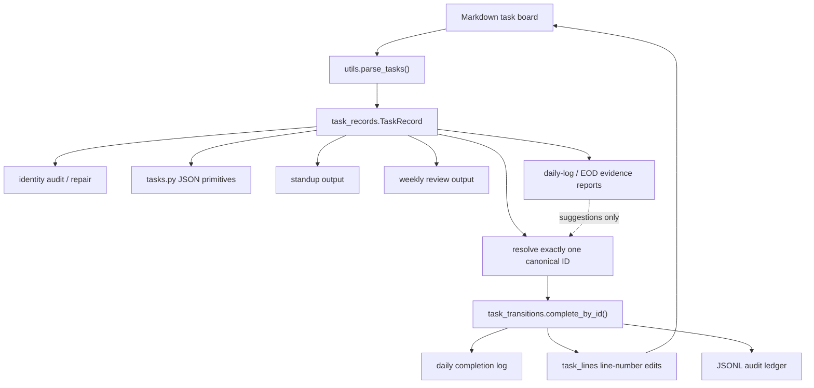

# refactor: consolidate task parser and mutation boundary

## Summary

Build PR #108B as the immediate follow-up to the merged canonical identity kernel. The goal is to make every task-tracker read surface consume one canonical active-task record model and make every active-board write route through the ID-only mutation kernel. This PR should not add the completion inbox, Gmail/calendar/session evidence, or broad state transitions.

**Target repo:** task-tracker-openclaw-skill. Unless explicitly prefixed with another repo alias, paths in this plan are relative to this repo.

---

## Problem Frame

PR #108A landed the correct foundation: inline `task_id::` metadata, identity audit/repair, ID-only `done`, and a minimal append-only ledger. The next risk is that the repository still contains multiple ways to interpret a task and multiple adjacent ways to make completion-like changes.

The clearest duplicate model is in `scripts/tasks.py`: primitive summaries build fallback IDs and canonical task dictionaries through `_build_task_catalog()`, `_task_identifier_bundle()`, and `_canonical_task()`, while `scripts/task_identity.py` separately exposes `IdentityRecord`, active-record filtering, fallback IDs, and canonical ID source semantics. Standup and weekly review still operate mostly on raw `parse_tasks()` dictionaries, and `scripts/eod_sync.py` still fuzzy-matches daily-note Done lines to weekly TODO lines and writes checked boxes by default.

That means 108A made the core safer, but the surrounding workflow code can still teach agents and users the wrong model. PR #108B should collapse those seams before evidence candidates or UX automation are expanded.

---

## Requirements

- R1. There must be one documented active-task read contract used by identity audit, primitive summaries, standup, and weekly review surfaces.
- R2. Canonical identity fields must have the same meaning everywhere: `task_id::` first, legacy `id::` readable as compatibility, fallback IDs diagnostic only, and fallback IDs never valid write targets.
- R3. No active-board mutation path may resolve a task by title, fuzzy title score, list position, generated fallback ID, or current parse order.
- R4. All active-board completion writes must route through the ID-only kernel in `scripts/task_transitions.py`.
- R5. Duplicate task-line removal/replacement helpers must be removed from public workflow code or centralized behind a line-number-verified kernel helper.
- R6. Standup and weekly review JSON primitives must emit stable canonical IDs where available and explicit `missing_task_id`/`fallback_only` diagnostics where not.
- R7. Daily-log and EOD completion parsing may produce evidence diagnostics or suggestions, but this PR must not auto-complete active tasks from title or fuzzy matches.
- R8. Legacy EOD sync behavior must be made visibly legacy and non-default, or changed to dry-run/report-only until the evidence inbox PR defines confirmation semantics.
- R9. Calendar helper output may classify meetings, but it must not mutate task truth or imply calendar status owns task state.
- R10. Public docs and command help must explain that 108B is parser/mutation consolidation, not the full vNext standup or evidence inbox.

**Origin traceability:** This plan implements the 108A follow-up explicitly named as "PR #108B: consolidate parser and mutation boundaries around one `TaskRecord` contract and remove duplicate task-line mutation helpers" in `docs/plans/2026-05-20-001-refactor-pr108-identity-kernel-split-plan.md`.

---

## Scope Boundaries

- Do not introduce completion candidates in this PR.
- Do not add Gmail, calendar, session-log, or Telegram DONE ingestion beyond read-only evidence diagnostics already present.
- Do not add first-class backlog/delegated/frozen/drop state transitions.
- Do not make JSONL ledger replay the source of current task truth.
- Do not redesign the daily standup or weekly review UX caps here; this PR only makes their task identity source coherent.
- Do not update Lobster cron workflows here. They should integrate after the task-tracker command contract is stable.
- Do not preserve fuzzy auto-mutation for compatibility if it can write task state without a canonical ID.

### Deferred to Follow-Up Work

- PR #108C: evidence inbox that creates suggestions only and applies confirmed items through ID-only `done`.
- Later workflow PR: wire Lobster standup, Telegram DONEs, weekly review, and cron flows to canonical IDs.
- Later UX PR: capped daily/EOD decision briefs, stale-task audits, freeze box, and proactive completion prompts.
- Later product slice: backlog/delegation/frozen states with a real state-transition contract.

---

## Context & Research

### Relevant Code and Patterns

- `scripts/utils.py` is still the markdown parser source. It returns raw dictionaries grouped into legacy sections and already parses `task_id::`, legacy `id::`, line numbers, due dates, recurrence, owner, area, and objective metadata.
- `scripts/task_identity.py` has the strongest current identity contract through `IdentityRecord`, `task_records()`, `active_records()`, `fallback_id_for()`, `export_active()`, and `audit_identity()`.
- `scripts/task_transitions.py` has the ID-only mutation kernel through `complete_by_id()`, line-number-verified `_remove_task_line()`, recurrence rollover, ledger preflight, daily-log write, and rollback on ledger append failure.
- `scripts/tasks.py` still builds a second task catalog for primitive summaries and daily-log ingestion. It generates slug/index fallback IDs, matches exact titles, accepts fuzzy matches, and emits auto-link decisions from `_ingest_match_line()`.
- `scripts/standup.py` loads raw parser dictionaries, uses `regroup_by_effective_priority()`, and emits compact JSON with generated quick IDs instead of canonical task IDs.
- `scripts/weekly_review.py` loads raw parser dictionaries, archives stale checked board items, and removes stale board lines through string replacement.
- `scripts/eod_sync.py` is explicitly documented as fuzzy auto-sync and writes `[x]` lines by default unless `--dry-run` is passed.
- `scripts/archive.py` and `scripts/tasks.py` both contain `_remove_task_line()` helpers separate from the line-number-verified helper in `scripts/task_transitions.py`.
- `tests/test_task_identity.py`, `tests/test_task_primitives.py`, `tests/test_objective_parser.py`, `tests/test_standup_compact.py`, `tests/test_eod_sync.py`, and `tests/test_task_transitions.py` are the relevant regression surfaces.

### Institutional Learnings

- The vNext requirements in `lobster-workflows:docs/brainstorms/2026-05-20-task-tracker-vnext-requirements.md` require canonical owner clarity, read-only audit versus metadata repair separation, direct ID-based DONE semantics, and a hard ban on title/list-position mutation.
- The failure diagnosis in `lobster-workflows:docs/debug/2026-05-20-task-tracker-ux-failures.md` identifies duplicate entries, missed DONEs, stale carryover, and noisy standups as source-of-truth failures.
- The radical simplification ideation in `lobster-workflows:docs/ideation/2026-05-20-task-tracker-radical-simplification-ideas.md` recommends one active board, durable IDs, one DONE pipeline, an audit ledger, and evidence-only external signals.
- Oracle's architecture review recommended landing 108A as a reduced identity kernel, then immediately doing 108B as single parser contract and compatibility cleanup before reintroducing completion evidence.

### External References

No external research is needed. The hard part is local boundary cleanup, not library or API behavior.

---

## Key Technical Decisions

- Use the existing parser as the markdown grammar owner. Do not create a second markdown parser; wrap `parse_tasks()` output into a typed canonical record model.
- Move the shared read contract into `scripts/task_records.py`. `scripts/task_identity.py` should become an audit/export consumer of that contract rather than the owner of a parallel identity model.
- Move line-number-verified task-line edit helpers into a small low-level text module, likely `scripts/task_lines.py`, so completion, archive cleanup, and stale checked-line cleanup do not import private helpers from workflow code.
- Keep fallback IDs visible only for audit and diagnostics. If a caller wants to write, it must use a real `task_id::` or legacy `id::` that resolves to exactly one active task.
- Treat daily-log ingestion and EOD sync as evidence producers, not mutation surfaces. Fuzzy matching may rank suggestions; it must not write task state.
- Keep the board as current-state truth and the ledger as audit history. This PR should not expand ledger semantics into replay or projection.
- Prefer compatibility by making unsafe commands report clear blocked/degraded output over silently preserving unsafe writes.

---

## High-Level Technical Design

This illustrates the intended approach and is directional guidance for review, not implementation specification. The implementing agent should treat it as context, not code to reproduce.

The important boundary is that read surfaces may consume fallback diagnostics, but write surfaces only accept a canonical ID that resolves to one active record. Evidence surfaces can suggest a match; they cannot write task state.

---

## Open Questions

### Resolved During Planning

- Should 108B be another broad UX/workflow PR? No. It is a consolidation PR between the landed kernel and future evidence inbox.
- Should standup and weekly review move to a database-backed model now? No. They should consume one parser-backed task record while Obsidian markdown remains current state.
- Should fuzzy matching disappear completely? No. It can stay for suggestion ranking and diagnostics, but not as a write target.
- Should fallback IDs be removed from outputs? No. They are useful for diagnostics and duplicate census, but outputs must label them as fallback-only and non-mutating.

### Deferred to Implementation

- Exact compatibility behavior for `scripts/eod_sync.py`. The implementer should pick the smallest public behavior change that prevents fuzzy auto-mutation by default and makes legacy risk painfully visible.
- Exact output field names for warnings. Preserve existing schemas where possible, but add explicit diagnostics rather than hiding missing IDs.

---

## Implementation Units

### U1. Characterize Current Parser and Write Behavior

**Goal:** Lock down the behaviors that must survive the refactor and expose the unsafe write behaviors that 108B must change.

**Requirements:** R1, R2, R3, R7, R8

**Dependencies:** None

**Files:**

- Modify: `tests/test_task_identity.py`
- Modify: `tests/test_task_primitives.py`
- Modify: `tests/test_objective_parser.py`
- Modify: `tests/test_standup_compact.py`
- Modify: `tests/test_eod_sync.py`
- Modify: `tests/test_task_transitions.py`

**Approach:**

- Add characterization tests before moving parser plumbing.
- Capture current support for Obsidian, legacy, objectives, plain task lines, bold task lines, subtasks, parking lot exclusion, `task_id::`, and legacy `id::`.
- Add failing tests for current duplicate model problems: primitive summaries and identity audit should agree on canonical ID, identity source, line number, section, title, area, and missing-ID diagnostics.
- Add tests proving fallback IDs are diagnostic and rejected for mutation.
- Add tests around EOD sync/default behavior so the implementation can safely change auto-write semantics.

**Execution note:** Characterization-first. Add the regression tests that describe today's parser and write boundaries before moving shared record or line-edit helpers.

**Test scenarios:**

- A task with `task_id::tsk_example` has the same canonical ID in identity audit, standup summary, weekly summary, and task primitive catalog output.
- A task with only legacy `id::legacy_example` is readable as compatibility but docs/output identify that it is not newly repaired metadata.
- A task without an ID appears as `missing_task_id` and `fallback_only` in read surfaces.
- Two tasks with the same title remain distinct by line and canonical ID in read surfaces.
- Passing a fallback/generated ID to `tasks.py done` returns an unsafe or resolution-failed error with no board write.
- `eod_sync.py` no longer writes weekly TODO completion by default from a fuzzy match.

**Verification:**

- The initial tests make the refactor target observable before implementation rearranges modules.

### U2. Introduce One Shared `TaskRecord` Read Contract

**Goal:** Replace ad hoc canonical-task dictionaries with one shared record shape built from `parse_tasks()` output.

**Requirements:** R1, R2, R6

**Dependencies:** U1

**Files:**

- Create: `scripts/task_records.py`
- Modify: `scripts/task_identity.py`
- Modify: `scripts/utils.py`
- Test: `tests/test_task_identity.py`
- Test: `tests/test_objective_parser.py`

**Approach:**

- Introduce a small dataclass or typed record that captures parser fields plus identity fields: canonical ID, identity source, fallback ID, title, done, section, area/department, priority, due, owner, goal, recurrence, raw line, and line number.
- Build records from `utils.parse_tasks()` so `scripts/utils.py` remains the only markdown grammar parser.
- Reuse or move `fallback_id_for()`, `opaque_task_id()`, `TASK_ID_RE`, and `LEGACY_ID_RE` so identity audit and other consumers share the same interpretation.
- Preserve parking-lot exclusion and active-record filtering semantics from `scripts/task_identity.py`.
- Add a serializer for read surfaces that includes `task_id`, `identity_source`, `fallback_id`, `missing_task_id`, and `fallback_only`.

**Test scenarios:**

- Parsed task metadata from Obsidian format survives conversion into `TaskRecord`.
- Objectives-format parent/child metadata survives conversion without losing `parent_objective` and `is_objective` behavior needed by existing objective tests.
- Parking-lot tasks are excluded from active records but still parseable when all records are requested.
- Malformed `task_id::` remains visible to identity audit.
- Fallback IDs are deterministic for the same raw line and line number.

**Verification:**

- Identity audit and existing parser tests pass while using the shared record contract internally.

### U3. Migrate Primitive Summaries to Shared Records

**Goal:** Make `tasks.py standup-summary`, `weekly-review-summary`, `calendar-sync`, and `ingest-daily-log` consume the shared task record catalog instead of building their own identity model.

**Requirements:** R1, R2, R3, R6, R9

**Dependencies:** U2

**Files:**

- Modify: `scripts/tasks.py`
- Modify: `scripts/task_identity.py`
- Test: `tests/test_task_primitives.py`
- Test: `tests/test_task_identity.py`

**Approach:**

- Replace `_build_task_catalog()`, `_task_identifier_bundle()`, `_canonical_task()`, `_task_id_lookup()`, and `_canonical_task_with_lookup()` with shared-record helpers.
- Preserve the primitive JSON schema where callers depend on it, but add explicit identity diagnostics for fallback-only rows.
- Ensure `calendar-sync` reports meeting tasks from shared records and remains a read-only helper.
- Keep daily-log ingestion as parsing and matching output only; it should produce evidence-like diagnostics, not a command that claims completion state changed.

**Test scenarios:**

- `standup-summary` and `weekly-review-summary` emit the same canonical ID for the same task.
- Duplicate titles with real canonical IDs stay distinct and stable in both summaries.
- Missing-ID tasks include `missing_task_id: true` and `fallback_only: true`.
- `calendar-sync` includes canonical IDs when available and warnings/diagnostics when IDs are missing.
- `ingest-daily-log` exact-ID matches point to canonical IDs from the shared record model.
- `ingest-daily-log` exact-title and fuzzy matches are marked as suggestions or needs-review, not auto-mutation instructions.

**Verification:**

- Primitive summary tests pass without any local fallback-ID generator in `scripts/tasks.py`.

### U4. Migrate Standup and Weekly Review Read Paths

**Goal:** Make user-facing standup and weekly review outputs use the same task identity contract as primitive summaries.

**Requirements:** R1, R2, R6

**Dependencies:** U2, U3

**Files:**

- Modify: `scripts/standup.py`
- Modify: `scripts/weekly_review.py`
- Modify: `scripts/utils.py`
- Test: `tests/test_standup_compact.py`
- Test: `tests/test_objective_parser.py`
- Test: `tests/test_task_primitives.py`

**Approach:**

- Keep the existing human-readable output shape where possible, but feed active task groups from shared records or record-derived dictionaries.
- Update compact standup JSON so task rows include canonical `task_id` when available rather than only quick IDs.
- Keep `quick_id` only as a display/session convenience if needed; it must not be documented as a mutation target.
- Ensure weekly review grouping, overdue calculations, and objective progress keep their existing semantics while using the shared read contract.

**Test scenarios:**

- Compact standup `dos` rows include canonical task IDs for tasks with `task_id::`.
- Compact standup rows with missing IDs include fallback diagnostics and do not present quick IDs as write targets.
- Weekly review `DO` rows match primitive summary identity fields for the same active tasks.
- Objective-format tasks still populate legacy priority buckets and objective progress after record conversion.
- Existing escalation, due-today, recurrence suffix, and grouping behavior remains unchanged.

**Verification:**

- Standup and weekly review consume one task identity model without product UX redesign.

### U5. Centralize Active-Board Line Mutation Helpers

**Goal:** Remove duplicate board-line mutation helpers from workflow surfaces and keep active-board edits behind line-number-verified kernel helpers.

**Requirements:** R3, R4, R5

**Dependencies:** U2

**Files:**

- Modify: `scripts/task_transitions.py`
- Create: `scripts/task_lines.py`
- Modify: `scripts/tasks.py`
- Modify: `scripts/archive.py`
- Modify: `scripts/weekly_review.py`
- Test: `tests/test_task_transitions.py`
- Test: `tests/test_objective_parser.py`
- Test: `tests/test_archive.py`

**Approach:**

- Move line-number-verified task-line removal/replacement into a low-level helper module that has no dependency on CLI, ledger, daily notes, standup, or weekly review code.
- Remove `scripts/tasks.py` string/index-based `_remove_task_line()` from public import paths.
- Update stale checked-line cleanup in archive/weekly code to use stable line-number matching when it truly needs to remove board lines.
- If a cleanup path cannot resolve a checked line by stable line number and raw line, it should skip and warn rather than string-replace the first matching title/line.

**Test scenarios:**

- Removing a parent task still removes indented continuation/subtask lines.
- Removing one duplicate-title task removes only the line resolved by line number and raw line.
- A stale checked board cleanup skips with a warning when the raw line no longer matches its parsed line number.
- No test imports `_remove_task_line` from `scripts/tasks.py`; tests import the shared/internal helper instead.

**Verification:**

- There is one active-board line mutation implementation used by completion and cleanup paths.

### U6. Make EOD Sync and Daily-Log Matching Evidence-Only

**Goal:** Stop fuzzy/title completion evidence from mutating task truth before the evidence inbox exists.

**Requirements:** R3, R7, R8

**Dependencies:** U3, U5

**Files:**

- Modify: `scripts/eod_sync.py`
- Modify: `scripts/tasks.py`
- Modify: `scripts/daily_notes.py`
- Test: `tests/test_eod_sync.py`
- Test: `tests/test_task_primitives.py`
- Test: `tests/test_done_scan_daily_links.py`

**Approach:**

- Change `scripts/eod_sync.py` so the safe default is report-only. If legacy write behavior is retained, put it behind an explicit flag with warning text that says it is a legacy fuzzy write path and not canonical task completion.
- Keep fuzzy scoring and normalization tests because they are useful for future evidence suggestions.
- Ensure `tasks.py ingest-daily-log` output never implies that `auto-link` has completed a task. Rename decisions or add fields if needed so exact-ID matches are still just evidence links.
- Confirm that the only command applying completion remains `tasks.py done <canonical-id>`.

**Test scenarios:**

- Running `eod_sync.py` without an apply flag leaves the weekly TODO file unchanged even for high-confidence matches.
- Running any retained legacy apply mode requires an explicit flag and emits a warning that it does not update canonical task state.
- `ingest-daily-log` fuzzy matches return suggestion/needs-review metadata and do not write the active board, daily notes, or ledger.
- Exact canonical ID evidence links are represented as high-confidence evidence, not direct mutations.
- The board content and ledger content are byte-identical before and after ingestion/report-only commands.

**Verification:**

- There is no fuzzy/title write path left in the default command surface.

### U7. Update Docs, Help, and Migration Notes

**Goal:** Make the public surface teach the new contract accurately.

**Requirements:** R2, R3, R8, R10

**Dependencies:** U3, U4, U5, U6

**Files:**

- Modify: `README.md`
- Modify: `SKILL.md`
- Modify: `docs/ARCHITECTURE.md`
- Modify: `docs/CALENDAR_INTEGRATION.md`
- Modify: `scripts/tasks.py`
- Test: `scripts/ci/check-public-hygiene.sh`

**Approach:**

- Document the 108B contract: one parser-backed task record, canonical IDs for writes, fallback IDs diagnostics only, fuzzy evidence report-only.
- Remove or rewrite command examples that suggest `done` by title, quick ID, fallback ID, or fuzzy EOD sync.
- Make `eod_sync.py` documentation visibly legacy if retained.
- Add a brief migration note: run identity audit/repair before expecting standup/weekly IDs to be complete.

**Test scenarios:**

- Public docs describe `tasks.py done <task_id>` as the only completion mutation.
- Public docs do not list fuzzy EOD sync as a default automation that marks canonical tasks done.
- Help text for ingestion/EOD paths uses evidence/report language rather than completion mutation language.
- Public hygiene checks pass.

**Verification:**

- A user or agent reading docs/help cannot reasonably infer that title/fuzzy matching is a safe write path.

---

## System-Wide Impact

- **User trust:** Standup and weekly output become less magical and more explicit about whether a task has a durable ID.
- **Agent behavior:** Agents get one canonical ID field to carry through standup, weekly review, and direct DONE commands.
- **Workflow safety:** EOD and daily-log parsing stop competing with the ID-only kernel.
- **Compatibility:** Existing read/report commands should keep broadly similar output, but unsafe default write behavior may be blocked or moved behind explicit legacy flags.
- **Future sequencing:** 108C can build an evidence inbox on top of shared records instead of inheriting current fuzzy write ambiguity.

---

## Risks & Dependencies

| Risk | Mitigation |
| ---- | ---------- |
| Record-model refactor breaks objectives-format behavior | Add characterization coverage before changing internals and keep `utils.parse_tasks()` as grammar owner. |
| Existing automation expects EOD sync to write by default | Make the behavior change explicit in docs/help and keep a consciously named legacy apply flag only if necessary. |
| Output schema changes break Lobster consumers | Preserve existing fields where possible and add identity diagnostics rather than renaming stable fields casually. |
| Shared helper placement creates circular imports | Keep pure read helpers in `scripts/task_records.py` and pure line-edit helpers in `scripts/task_lines.py`, with workflow modules depending downward. |
| Fallback IDs leak back into mutation commands | Test `done <fallback-id>` and duplicate-title cases explicitly. |

---

## Phased Delivery

1. Add characterization tests for current parser, identity, primitive, standup, weekly, EOD, and mutation behavior.
2. Introduce the shared task record contract and migrate identity audit to it.
3. Migrate `tasks.py` primitive summary and evidence parsing helpers.
4. Migrate standup and weekly review read paths.
5. Centralize active-board line mutation helpers.
6. Make EOD/daily-log fuzzy matching report-only by default.
7. Update docs/help and run the full local verification suite.

---

## Documentation Plan

- Update `README.md` and `SKILL.md` to describe the stable command contract after 108B.
- Update `docs/ARCHITECTURE.md` so diagrams and prose show shared parser/record flow rather than parallel identity models.
- Update `docs/CALENDAR_INTEGRATION.md` if it implies calendar status can mutate task truth.
- Keep the broader vNext requirements in the Lobster docs as product direction, not as a claim that 108B delivers the complete UX.

---

## Verification Strategy

- Run `pytest -q tests/test_task_identity.py tests/test_objective_parser.py tests/test_task_primitives.py tests/test_standup_compact.py tests/test_eod_sync.py tests/test_task_transitions.py tests/test_archive.py tests/test_done_scan_daily_links.py`.
- Run `pytest -q` before opening the PR if runtime is acceptable.
- Run `bash scripts/ci/check-public-hygiene.sh`.
- Run `python3 scripts/tasks.py --help`, `python3 scripts/tasks.py done --help`, `python3 scripts/tasks.py ingest-daily-log --help`, and `python3 scripts/eod_sync.py --help` to verify public language.
- For manual verification, use fixture task files with duplicate titles, missing IDs, real `task_id::`, legacy `id::`, objectives format, and high-confidence fuzzy EOD matches.

---

## Sources & References

- `docs/plans/2026-05-20-001-refactor-pr108-identity-kernel-split-plan.md`
- `lobster-workflows:docs/brainstorms/2026-05-20-task-tracker-vnext-requirements.md`
- `lobster-workflows:docs/debug/2026-05-20-task-tracker-ux-failures.md`
- `lobster-workflows:docs/ideation/2026-05-20-task-tracker-radical-simplification-ideas.md`
- Oracle architecture review pasted in the planning conversation on 2026-05-20
