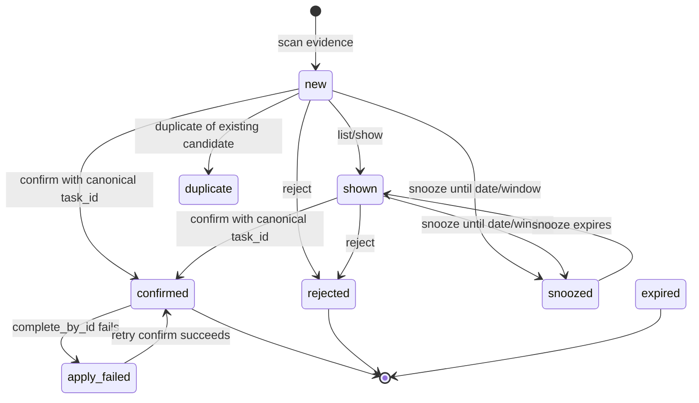
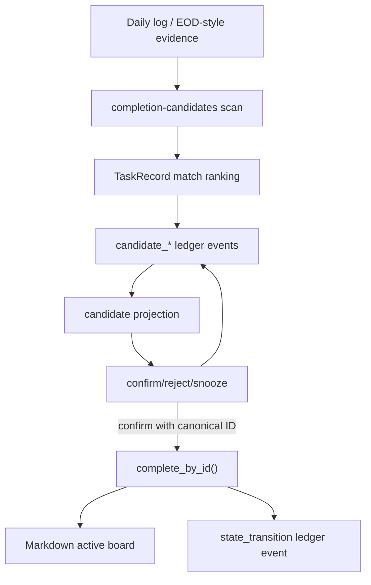

# feat: add completion evidence inbox

## Summary

Build PR #108C as the narrow completion evidence inbox promised by the 108A/108B sequence. The inbox turns daily-log and EOD-style completion evidence into reviewable candidates, dedupes repeated scans, and applies confirmed completions only through the ID-only `complete_by_id()` path. It must not add Gmail, calendar, session-log, Telegram, Lobster cron wiring, standup UX redesign, or fuzzy/title auto-mutation.

**Target repo:** task-tracker-openclaw-skill. Paths in this plan are repo-relative.

---

## Problem Frame

108A landed the canonical identity kernel: `task_id::`, identity audit/repair, ID-only `done`, and append-only ledger events for repair/done. 108B consolidated parsing around `TaskRecord`, moved board line edits into line-number-verified helpers, and made fuzzy/EOD flows evidence-only by default. The hardening PR then closed the main P1 risks before candidate work: malformed ledger reads are visible, `complete_by_id()` restores snapshots on write failure, and weekly stale cleanup uses the shared line helper.

The next missing piece is a safe place for "I probably did this" evidence to accumulate without pretending the evidence completed a task. Today `tasks.py ingest-daily-log` can rank matches, but the output is ephemeral. A user or agent has no durable inbox to review, reject, snooze, dedupe, or confirm later. 108C should add that inbox while preserving the source-of-truth boundary: active board markdown is current state; the ledger is audit/candidate history; daily notes are human-facing evidence.

Final Oracle review found no P0 blocker in 108C and judged the foundation good
enough to build on. The next PR should not add Gmail, calendar, or session-log
ingestion. It should extract evidence matching out of private `tasks.py` helpers,
make candidate JSON harder to misuse, and wire standup, EOD, Telegram, and
Lobster surfaces over the existing inbox. That work is tracked in
`docs/plans/2026-05-21-004-feat-inbox-workflow-consumption-plan.md`.

---

## Requirements

- R1. Evidence scans must never mutate the active board, daily completion log, or canonical task state.
- R2. Candidate state must be durable and reconstructable from append-only ledger events.
- R3. Candidate IDs must be stable across repeated scans of the same source evidence, so rescanning is idempotent.
- R4. Candidate confirmation must require exactly one canonical task ID and must call `complete_by_id()` or the same ID-only transition path.
- R5. Fuzzy, normalized-title, and fallback-only matches may rank suggestions but must not be confirmable without an explicit canonical task ID.
- R6. Candidate lifecycle must distinguish at least: `new`, `shown`, `confirmed`, `rejected`, `snoozed`, `duplicate`, `expired`, and `apply_failed`.
- R7. Apply failure must be recorded durably and leave the candidate retryable.
- R8. Malformed ledger history must block candidate state reconstruction or surface a degraded/error payload; it must not silently produce a clean inbox.
- R9. The first 108C slice may consume daily-log / existing EOD-style evidence only.
- R10. Public docs and command help must make clear that this is an evidence inbox, not auto-completion automation.

**Origin traceability:** This implements the deferred 108C slice from `docs/plans/2026-05-20-001-refactor-pr108-identity-kernel-split-plan.md`, especially U7: "Evidence Inbox, Suggestions Only." It also relies on the hardening preflight in `docs/plans/2026-05-21-002-hardening-108b-before-evidence-inbox-plan.md`.

---

## Scope Boundaries

### In Scope

- Candidate creation from explicit input files/stdin using existing daily-log parsing semantics.
- Candidate creation from local daily note completion logs for a bounded date/window.
- Candidate dedupe and state reconstruction from ledger events.
- Candidate list/show JSON commands for agents and CLI users.
- Candidate confirm/reject/snooze commands.
- Confirmation through canonical ID-only completion.
- Tests proving scan/list/confirm/reject/snooze behavior and failure semantics.

### Deferred to Follow-Up Work

- PR #108D workflow consumption before noisy source ingestion: shared evidence
  matching, `confirmable_task_id` versus `suggested_match`, standup/EOD/weekly
  candidate visibility, and Telegram/Lobster inbox controls.
- Gmail, calendar, session-log, Telegram DONEs, and Lobster cron ingestion.
- Morning standup and EOD UX redesign.
- Bulk confirm or auto-confirm.
- Backlog/delegation/frozen/drop state transitions.
- Ledger replay as active-board source of truth.
- Removing the legacy `eod_sync.py --apply` weekly TODO write mode.

### Out of Scope

- Any title, fuzzy, fallback ID, quick ID, or list-position mutation.
- Any change that makes Weekly TODOs canonical task truth.
- Any candidate source that requires external credentials.

---

## Assumptions

- The ledger can store candidate lifecycle events alongside state transition events using `new_event()` with distinct `event_type` values.
- Candidate current state can be derived by replaying candidate events in timestamp/file order; no separate database is needed for this slice.
- Existing `ingest-daily-log` matching output is a useful input shape, but 108C may wrap/rename its internal concepts so fuzzy evidence is described as `suggested_match`, not permission to mutate.
- The first implementation should prefer JSON-first CLI output because the main consumers are agents and workflow scripts.

---

## Key Technical Decisions

- **Use the ledger as the durable candidate event store.** This avoids adding a second state file while preserving append-only auditability. Candidate state is projection, not source of task truth.
- **Use stable candidate IDs derived from evidence identity, not task match identity alone.** The same done line should dedupe even if match ranking changes after task titles are edited.
- **Store source pointers minimally.** Daily-note evidence should record source type, path/date when available, line number when available, raw summary, normalized summary, and redacted/machine-parseable match metadata. Do not copy whole daily notes into ledger events.
- **Make exact canonical ID evidence the only pre-confirmed match class.** Fuzzy/title matches can suggest a canonical ID, but confirmation should still require that ID explicitly or by selecting the candidate with an unambiguous canonical `matched_task_id`.
- **Block on malformed ledger reads for candidate commands.** Candidate state built from partial event history is worse than a loud degraded result.

---

## High-Level Technical Design

This illustrates the intended approach and is directional guidance for review, not implementation specification. The implementing agent should treat it as context, not code to reproduce.

---

## Implementation Units

### U1. Candidate Event Model and Projection

**Goal:** Add a durable candidate lifecycle model backed by append-only ledger events.

**Requirements:** R2, R3, R6, R8

**Dependencies:** None

**Files:**

- Create: `scripts/completion_candidates.py`
- Modify: `scripts/task_ledger.py`
- Test: `tests/test_completion_candidates.py`
- Test: `tests/test_task_ledger.py`

**Approach:**

- Define candidate event types such as `candidate_seen`, `candidate_shown`, `candidate_confirmed`, `candidate_rejected`, `candidate_snoozed`, `candidate_duplicate`, `candidate_expired`, and `candidate_apply_failed`.
- Add helpers that read candidate events with strict ledger parsing and project current candidate state.
- Generate stable `candidate_id` values from source type, source pointer, normalized evidence summary, and optional evidence timestamp/line number.
- Keep candidate records separate from active task records: candidates may reference `matched_task_id`, but they are not tasks.

**Patterns to follow:**

- `scripts/task_ledger.py` for event envelope and strict malformed-line handling.
- `scripts/task_records.py` for canonical task identity fields and fallback diagnostics.

**Test scenarios:**

- Scanning the same evidence twice produces one active candidate projection.
- A malformed ledger line causes candidate projection to fail loudly or return a degraded JSON error.
- A candidate with repeated lifecycle events projects to the latest terminal state.
- Candidate projection preserves source pointer, normalized summary, match metadata, and status.

**Verification:**

- Candidate state can be reconstructed from ledger events without reading or mutating the active board.

### U2. Evidence Scan From Daily Log / Existing Ingest Semantics

**Goal:** Convert daily-log/EOD-style evidence into candidates without mutating task truth.

**Requirements:** R1, R3, R5, R9

**Dependencies:** U1

**Files:**

- Modify: `scripts/completion_candidates.py`
- Modify: `scripts/tasks.py`
- Test: `tests/test_completion_candidates.py`
- Test: `tests/test_task_primitives.py`

**Approach:**

- Reuse or extract the existing done-line parsing and `TaskRecord` match-ranking behavior from `tasks.py ingest-daily-log`.
- Expose a candidate scan path that accepts `--file`, stdin, and a daily-note date/window input.
- Store fuzzy/title results as `suggested_match` metadata rather than `evidence-link` instructions.
- Treat fallback-only matches as review-only suggestions with no confirmable task ID.
- Avoid changing `ingest-daily-log` output unless needed for clarity; if changed, preserve a compatibility path or update schema docs and tests.

**Test scenarios:**

- Exact canonical ID evidence creates a candidate with `matched_task_id`.
- Normalized-title evidence creates a candidate with a suggested match but no auto-apply.
- Fuzzy evidence creates a candidate in review state with score metadata.
- Fallback-only evidence creates a candidate that cannot be confirmed without a supplied canonical ID.
- Re-running scan with the same file/stdin content does not create duplicate active candidates.

**Verification:**

- Scans append candidate events only; active board, daily note completion log, and task state transition events remain unchanged.

### U3. Candidate CLI Commands

**Goal:** Add JSON-first CLI commands for scanning, listing, showing, and deciding candidates.

**Requirements:** R1, R4, R6, R7, R10

**Dependencies:** U1, U2

**Files:**

- Modify: `scripts/tasks.py`
- Modify: `references/commands.md`
- Modify: `references/task-primitives-schema-v1.md`
- Test: `tests/test_completion_candidates.py`

**Approach:**

- Add a `completion-candidates` command group or equivalent subcommands under `tasks.py`.
- Provide at least: `scan`, `list`, `show`, `confirm`, `reject`, and `snooze`.
- Keep all outputs in the stable schema envelope style used by existing primitives.
- Ensure `confirm` accepts a candidate ID and either uses the candidate's exact canonical `matched_task_id` or requires an explicit `--task-id`.
- Make errors structured: missing candidate, ambiguous/missing task ID, malformed ledger, candidate already terminal, apply failure, and invalid snooze date/window.

**Test scenarios:**

- `scan --file` returns created/existing candidate counts and candidate rows.
- `list` shows only actionable candidates by default and can include terminal candidates with an option.
- `show <candidate_id>` returns source, status, match metadata, and decision history.
- `reject <candidate_id>` records a rejection and removes it from default actionable list.
- `snooze <candidate_id> --until YYYY-MM-DD` hides it until the date/window and preserves it in full history.

**Verification:**

- CLI users and agents can review and decide candidates without parsing raw ledger lines.

### U4. Confirm Through ID-Only Done and Record Apply Results

**Goal:** Make candidate confirmation call the hardened ID-only completion kernel and record decision/apply results.

**Requirements:** R4, R5, R7, R8

**Dependencies:** U1, U3

**Files:**

- Modify: `scripts/completion_candidates.py`
- Modify: `scripts/tasks.py`
- Test: `tests/test_completion_candidates.py`
- Test: `tests/test_task_transitions.py`

**Approach:**

- On confirm, validate candidate status and canonical task ID before mutation.
- Call `complete_by_id(task_id, source="completion_candidate")`.
- On success, append candidate confirmation metadata that links candidate ID to the resulting transition event ID.
- On failure, append `candidate_apply_failed` with the structured error and leave the candidate retryable.
- Do not mark a candidate confirmed before the ID-only completion succeeds unless the event clearly records that application failed.

**Test scenarios:**

- Confirming an exact-ID candidate removes/rolls forward the active task and writes both candidate and state-transition events.
- Confirming a title-only/fuzzy candidate without canonical ID fails with no board write.
- Confirming with explicit `--task-id` succeeds only when that canonical ID resolves exactly once.
- If `complete_by_id()` fails, candidate status becomes `apply_failed`, active board remains restored, and retry is possible.
- Confirming an already confirmed/rejected/expired candidate returns a structured error and writes no duplicate state transition.

**Verification:**

- Candidate confirmation cannot create a second mutation path around `complete_by_id()`.

### U5. Documentation, Schema, and Guardrails

**Goal:** Document the evidence inbox contract and keep future agents from treating suggestions as completions.

**Requirements:** R5, R9, R10

**Dependencies:** U1, U2, U3, U4

**Files:**

- Modify: `README.md`
- Modify: `SKILL.md`
- Modify: `docs/ARCHITECTURE.md`
- Modify: `references/commands.md`
- Modify: `references/task-primitives-schema-v1.md`
- Add or modify: `docs/plans/2026-05-21-003-feat-completion-evidence-inbox-plan.md`

**Approach:**

- Add examples that show scan/list/confirm/reject/snooze behavior without implying auto-completion.
- Document that Gmail/calendar/session/Lobster ingestion is deliberately deferred.
- Document that fuzzy/title/fallback suggestions require explicit canonical ID confirmation.
- Keep legacy EOD `--apply` clearly separate from canonical completion candidates.

**Test scenarios:**

- Help text and docs do not advertise auto-confirm or fuzzy completion.
- Schema docs show candidate states and structured error payloads.
- Public hygiene checks pass.

**Verification:**

- A user or agent reading docs/help can identify the safe path: scan evidence, review candidate, confirm by canonical task ID.

---

## System-Wide Impact

- **User trust:** Done evidence becomes reviewable and durable rather than silently disappearing into one-off JSON output.
- **Agent behavior:** Agents get a safe decision queue instead of using fuzzy/title output as a mutation instruction.
- **Workflow safety:** 108C creates the future integration target for EOD, Telegram, Gmail, calendar, session logs, and Lobster cron without wiring those sources yet.
- **Auditability:** Candidate decisions become ledger events linked to task state transitions when confirmation succeeds.
- **Compatibility:** Existing `ingest-daily-log` can remain as a read-only primitive while the new inbox provides durable candidate state.

---

## Risks & Dependencies

| Risk | Mitigation |
| ---- | ---------- |
| Candidate ledger projection becomes a second task system | Keep candidates separate from task state; only `complete_by_id()` mutates active tasks. |
| Fuzzy/title suggestions are mistaken for permission to complete | Use `suggested_match` language and block confirm without canonical task ID. |
| Repeated scans flood the inbox | Stable candidate IDs and candidate-state projection dedupe by source evidence. |
| Apply failure creates confusing "confirmed but active" states | Record `apply_failed` separately and keep candidate retryable. |
| Ledger malformed lines corrupt candidate projection | Use strict/reporting ledger reads for candidate commands and return degraded/error payloads. |
| CLI surface grows too broad | Limit first slice to scan/list/show/confirm/reject/snooze and daily/EOD-style evidence only. |

---

## Deferred Implementation Notes

- Final CLI spelling can be `completion-candidates` or a shorter alias if local command conventions make one clearly better.
- Exact candidate event names may vary, but they must remain distinct from `state_transition` events.
- 108C candidate payloads are safe in code, but 108D should make JSON harder for
  agents to misuse: exact ID/link evidence may expose `confirmable_task_id`,
  while title/fuzzy/fallback evidence should expose only `suggested_match` and
  review-required metadata.
- Candidate expiry policy can be manual or simple time-window based in this slice; do not add scheduler/cron expiry yet.
- Daily-note scan line-number fidelity may depend on existing extractor detail. If source line numbers are not available, use a stable source pointer based on date/path plus normalized summary and timestamp where available.

---

## Verification Strategy

- Run focused candidate tests for scan/list/show/confirm/reject/snooze and apply failure.
- Run existing identity, transition, ledger, primitive, EOD, and weekly tests to prove the new inbox does not regress the foundation.
- Run CLI help checks for `tasks.py done`, `tasks.py ingest-daily-log`, and new completion-candidate commands.
- Run public hygiene and markdown lint on changed docs.
- Manually inspect sample JSON for one exact-ID candidate, one fuzzy suggestion, one fallback-only candidate, one rejected candidate, and one apply-failed candidate.
- After 108C lands, run an Oracle/Codex checkpoint before external ingestion.
  The final checkpoint recommends 108D as workflow consumption plus matcher
  extraction, with Gmail/calendar/session ingestion deferred one more PR.

---

## Sources & References

- `docs/plans/2026-05-20-001-refactor-pr108-identity-kernel-split-plan.md`
- `docs/plans/2026-05-21-001-refactor-single-parser-mutation-boundary-plan.md`
- `docs/plans/2026-05-21-002-hardening-108b-before-evidence-inbox-plan.md`
- `docs/ARCHITECTURE.md`
- Oracle progress review pasted in the planning conversation on 2026-05-21
- Post-108C Oracle progress reviews pasted in the planning conversation on 2026-05-21
