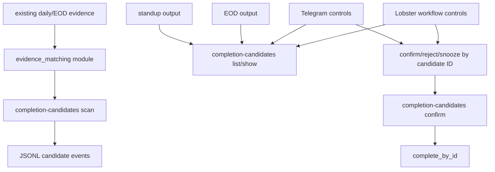

<!-- markdownlint-disable MD025 -->

# feat: wire task tracker inbox into workflows

## Summary

Build the next PR after 108C as a workflow-consumption slice. The foundation is
good enough to build on: board markdown owns current task state, `task_id::` is
the mutation identity, `TaskRecord` is the shared read model, JSONL stores audit
and candidate history, and completion candidates confirm through the ID-only
`complete_by_id()` kernel.

The next PR should wire that inbox into the daily product loop without adding
new external evidence ingestion. It should extract evidence matching out of the
CLI layer, make candidate JSON harder to misuse, then expose existing inbox
actions through standup, EOD, Telegram, and Lobster workflow surfaces.

**Target repo:** task-tracker-openclaw-skill. Paths in this plan are
repo-relative. Lobster workflow paths are referenced with the `lobster-workflows:`
repo alias.

---

## Problem Frame

108C created a durable completion evidence inbox, but the user path is still
mostly CLI-level: scan, list/show, confirm/reject/snooze. The next product gap
is not Gmail, calendar, or session-log ingestion. Those sources would multiply
ambiguity, privacy, source-pointer, dedupe, and false-positive risk before the
local workflow loop proves itself.

The safer next move is to let existing daily surfaces consume the inbox:

- Standup and EOD should show candidate counts, candidate IDs, suggested task
  IDs, and clear "review required" language.
- Telegram and Lobster wrappers should list, show, reject, snooze, and confirm
  candidates by candidate ID and canonical task ID.
- Confirmation must still call the existing `completion-candidates confirm`
  command and preserve its canonical-ID guardrails.
- No workflow path should auto-confirm or call `done` from title, fuzzy match,
  fallback ID, quick ID, calendar event, Gmail message, session note, or list
  position.

Oracle's final 2026-05-21 architecture checkpoint found no P0s. It did identify
two small blockers before workflow wiring: evidence matching should move out of
`tasks.py`, and candidate JSON should separate direct confirmability from
suggestions so agents cannot mistake a fuzzy/title suggestion for authority to
complete a task.

---

## Requirements

- R1. Evidence matching must move from private `tasks.py` helpers into a
  non-CLI module such as `scripts/evidence_matching.py`.
- R2. Both `tasks.py ingest-daily-log` and `completion-candidates scan` must use
  the shared matcher module.
- R3. Candidate JSON must expose `confirmable_task_id` only when exact ID/link
  evidence is safe to confirm without an extra `--task-id`.
- R4. Title, fuzzy, fallback, and normalized-title evidence may expose
  `suggested_match`, but must not expose `confirmable_task_id`.
- R5. Standup, EOD, and weekly workflow output must show candidate counts,
  candidate IDs, suggested task IDs when available, and explicit review-required
  language.
- R6. Standup, EOD, and weekly workflow output must not auto-confirm candidates
  or call `done`.
- R7. Telegram and Lobster wrappers must operate as control surfaces over the
  existing inbox: list, show, reject, snooze, and confirm by candidate ID.
- R8. Candidate confirmation from any wrapper must call
  `completion-candidates confirm` or equivalent existing inbox code and must
  require a canonical task ID unless the candidate is exact ID/link evidence.
- R9. Gmail, calendar, and session-log evidence ingestion must remain deferred.
- R10. Docs and CLI help must make the safe path obvious: scan evidence, review
  candidate, confirm by canonical ID.

**Origin traceability:** This plan updates the deferred workflow step from
`docs/plans/2026-05-20-001-refactor-pr108-identity-kernel-split-plan.md` and the
post-108C follow-up notes in
`docs/plans/2026-05-21-003-feat-completion-evidence-inbox-plan.md`.

---

## Scope Boundaries

### In Scope

- Shared evidence matcher extraction.
- Candidate JSON clarification around `confirmable_task_id` and
  `suggested_match`.
- Standup/EOD/weekly read surfaces that display inbox status and review actions.
- Telegram/Lobster workflow wrappers over existing candidate commands.
- Tests proving workflow surfaces do not mutate canonical task state from unsafe
  evidence.
- Docs and help text for the workflow-consumption path.

### Deferred to Follow-Up Work

- Periodic task audits for duplicate titles, stale active tasks, unresolved
  candidates, identity issues, and backlog pressure. This became the next
  automation layer before source ingestion; see
  `docs/plans/2026-05-22-001-feat-periodic-task-audits-plan.md`.
- Gmail evidence ingestion.
- Calendar evidence ingestion.
- Session-log evidence ingestion.
- Bulk confirm, auto-confirm, or autonomous DONE application.
- First-class delegated/backlog/frozen lifecycle states.
- Broader daily/EOD/weekly UX redesign beyond candidate visibility and actions.
- Ledger replay as active-board source of truth.

### Out of Scope

- Any title, fuzzy, fallback ID, quick ID, calendar event, Gmail message,
  session note, list-position, or local numeric-ID mutation.
- Any new credentialed external source adapter.
- Any change that makes Telegram a new evidence-ingestion source. Telegram is a
  control surface in this PR.
- Any broad replacement of the Obsidian editable board model.

---

## Assumptions

- The task-tracker repo can add or adjust wrapper scripts/docs for workflow
  consumption, while Lobster-specific cron or Telegram wiring may land in
  `lobster-workflows:` if the implementation reaches that repo.
- Existing candidate lifecycle behavior from 108C is retained: scan is
  non-mutating, strict malformed-ledger reads block unsafe projections, and
  confirm applies through ID-only completion.
- Candidate JSON may add clearer fields while preserving older fields where
  reasonable for compatibility.
- Weekly output is a read surface in this PR, not a weekly archive or closeout
  redesign.

---

## Key Technical Decisions

- **Wire workflows before adding noisy sources.** Standup, EOD, Telegram, and
  Lobster usage will validate the inbox loop with low new data-source risk.
- **Extract the matcher first.** Workflow code should import a stable domain
  module, not private CLI helpers.
- **Separate confirmability from suggestion.** `confirmable_task_id` means the
  candidate can be confirmed without extra task selection; `suggested_match`
  means "review this possible task."
- **Keep Telegram as control, not ingestion.** Telegram actions may review and
  decide existing candidates, but they should not create a new Telegram DONE
  evidence source in this PR.
- **Keep completion centralized.** Every workflow confirmation path routes
  through the existing candidate confirmation command or core function.

---

## High-Level Technical Design

This diagram is directional guidance for review, not an implementation
specification.

---

## Implementation Units

### U1. Shared Evidence Matcher Extraction

Files to inspect/change:

- `scripts/evidence_matching.py` (new)
- `scripts/tasks.py`
- `scripts/completion_candidates.py`
- `scripts/task_records.py`
- `tests/test_task_primitives.py`
- `tests/test_completion_candidates.py`

Approach:

Move evidence line extraction, task catalog construction, record loading, and
match classification out of `tasks.py` into a small module. Keep `tasks.py` as a
CLI adapter. Preserve the current read-only ingest behavior and candidate scan
behavior while removing private-helper imports from `completion_candidates.py`.

Test scenarios:

- `completion_candidates.py` no longer imports private `_...` helpers from
  `tasks.py`.
- `tasks.py ingest-daily-log` and `completion-candidates scan` produce equivalent
  match decisions for exact ID, title-only, fuzzy, and fallback-only evidence.
- Duplicate title and fallback-only evidence remain suggestions, not mutation
  authority.
- Malformed task records or task-file read failures still produce the existing
  safe error/degraded behavior.

### U2. Candidate JSON Confirmability Semantics

Files to inspect/change:

- `scripts/completion_candidates.py`
- `scripts/evidence_matching.py`
- `references/task-primitives-schema-v1.md`
- `tests/test_completion_candidates.py`

Approach:

Add or standardize two JSON concepts: `confirmable_task_id` and
`suggested_match`. Only exact canonical ID/link evidence may set
`confirmable_task_id`. Title, normalized-title, fuzzy, and fallback evidence may
include `suggested_match`, alternatives, confidence, and review notes, but must
not look directly confirmable without a supplied canonical task ID.

Test scenarios:

- Exact canonical ID/link candidate includes `confirmable_task_id`.
- Title-only candidate includes `suggested_match` but not `confirmable_task_id`.
- Fuzzy candidate includes `suggested_match` but not `confirmable_task_id`.
- Fallback-only candidate includes diagnostic match data but not
  `confirmable_task_id`.
- Confirmation without `--task-id` still succeeds only for exact ID/link
  candidates.
- Confirmation without `--task-id` still fails for title, fuzzy, and fallback
  candidates.

### U3. Standup, EOD, and Weekly Candidate Visibility

Files to inspect/change:

- `scripts/standup.py`
- `scripts/eod_review.py`
- `scripts/weekly_review.py`
- `scripts/tasks.py`
- `tests/test_standup_compact.py`
- `tests/test_task_primitives.py`
- `tests/test_completion_candidates.py`

Approach:

Add read-only candidate summaries to the daily review surfaces. Output should
show candidate counts, candidate IDs, suggested canonical task IDs when present,
and clear review-required language. The output should be concise enough for
standup/EOD usage and explicit enough that agents know which command to call
next. These surfaces must not mutate board, daily log, or ledger state except for
existing explicit read-side behavior such as marking candidates shown only if
already supported and intentionally invoked.

Test scenarios:

- Standup compact output includes candidate count and candidate IDs.
- EOD output includes candidate count and candidate IDs.
- Weekly output includes candidate count or a review pointer without archive or
  closeout mutation.
- Title/fuzzy/fallback candidates are labeled review-required.
- Standup/EOD/weekly code does not call `done` or `complete_by_id`.
- Board and daily-log files remain unchanged after read-only workflow rendering.

### U4. Telegram and Lobster Inbox Controls

Files to inspect/change:

- `scripts/tasks.py`
- `README.md`
- `SKILL.md`
- `references/commands.md`
- `lobster-workflows:scripts/`
- `lobster-workflows:docs/`
- `tests/test_completion_candidates.py`
- `tests/test_tasks.py`

Approach:

Expose workflow-friendly commands or wrapper scripts that list, show, reject,
snooze, and confirm candidates by candidate ID. If Lobster-specific changes are
needed, keep them as thin wrappers over task-tracker commands. Telegram should
act as a control surface for existing candidates, not as a new source that scans
messages into candidates.

Test scenarios:

- Wrapper list/show commands return candidate IDs and candidate status.
- Wrapper reject and snooze commands call existing candidate decision paths.
- Wrapper confirm calls existing `completion-candidates confirm`.
- Wrapper confirm requires `--task-id` unless the candidate has
  `confirmable_task_id`.
- No wrapper calls `done` by title, fuzzy match, fallback ID, quick ID, or list
  position.
- Personal/work ledger separation remains intact through wrapper usage.

### U5. Workflow Safety Regression Suite

Files to inspect/change:

- `tests/test_completion_candidates.py`
- `tests/test_task_transitions.py`
- `tests/test_task_primitives.py`
- `tests/test_standup_compact.py`
- `tests/test_tasks.py`
- `tests/fixtures/`

Approach:

Add tests around the whole workflow path, not just storage internals. The suite
should prove that candidate visibility and wrappers cannot mutate tasks from
unsafe evidence and that existing 108C failure semantics still hold.

Test scenarios:

- Duplicate title candidates do not auto-complete.
- Fallback-only candidates cannot confirm without supplied canonical task ID.
- Malformed ledger blocks candidate list/show/decision.
- Snoozed candidates become visible/actionable again after the snooze date in
  the surfaces that display candidates.
- Apply failure remains retryable.
- Personal/work ledger separation is preserved.
- Scans and read-only workflow rendering do not mutate board or daily log.
- Unsafe sources such as calendar event, Gmail message, session note, quick ID,
  and list position cannot complete a task through workflow code.

### U6. Docs and Help Updates

Files to inspect/change:

- `README.md`
- `SKILL.md`
- `docs/ARCHITECTURE.md`
- `references/commands.md`
- `docs/plans/2026-05-20-001-refactor-pr108-identity-kernel-split-plan.md`
- `docs/plans/2026-05-21-003-feat-completion-evidence-inbox-plan.md`
- `lobster-workflows:docs/`

Approach:

Document the safe workflow path in plain operational terms: scan evidence, review
candidate, confirm by canonical ID. Repeat that Gmail, calendar, and session-log
ingestion remain deferred. Make clear that Telegram and Lobster are wrappers over
the existing inbox unless a later PR explicitly scopes new ingestion.

Test scenarios:

- CLI help for candidate commands describes `confirmable_task_id` versus
  `suggested_match` if those fields are user-facing.
- Docs say Telegram/Lobster are control surfaces over the inbox.
- Docs say Gmail/calendar/session ingestion is not part of this PR.
- Docs do not tell users or agents to complete tasks by title, fuzzy match,
  fallback ID, quick ID, or list position.

---

## System-Wide Impact

- **Daily workflow:** Standup and EOD start showing the completion inbox instead
  of leaving it as an isolated CLI feature.
- **Agent safety:** Agents get explicit candidate IDs, canonical task IDs, and
  review-required language instead of inferring from fuzzy/title matches.
- **Workflow integration:** Lobster and Telegram can act on existing candidates
  without introducing new evidence-source risk.
- **Future ingestion:** Gmail, calendar, and session-log adapters will consume a
  matcher module and proven workflow loop rather than CLI internals.

---

## Risks & Dependencies

- **Workflow PR becomes too broad:** keep the first slice to matcher extraction,
  candidate JSON clarity, and inbox control surfaces. Defer source ingestion.
- **Telegram is mistaken for evidence ingestion:** docs and tests must frame it
  as list/show/decision control over existing candidates only.
- **Candidate summaries get noisy:** show counts and top candidate IDs, with
  links/commands to drill in instead of dumping the whole inbox.
- **Wrapper code bypasses safety:** all confirmation paths must call existing
  candidate confirmation, not `done` directly.
- **Lobster changes require cross-repo coordination:** keep wrappers thin and
  command-based so the task-tracker contract remains the source of truth.

---

## Phased Delivery

1. Extract evidence matching into a shared non-CLI module.
2. Add `confirmable_task_id` and `suggested_match` semantics to candidate JSON.
3. Add read-only candidate summaries to standup, EOD, and weekly outputs.
4. Add Telegram/Lobster wrapper controls over list/show/reject/snooze/confirm.
5. Add workflow safety regression tests.
6. Update docs/help and run verification.

---

## Documentation Plan

- Update `README.md`, `SKILL.md`, and `references/commands.md` with the safe
  candidate workflow.
- Update `docs/ARCHITECTURE.md` to show evidence matching as a module below CLI
  and workflow wrappers.
- Update prior plan docs so the next PR is workflow consumption plus matcher
  extraction, not broad hardening or external ingestion.
- If Lobster docs are touched, repeat that Telegram/Lobster are control surfaces
  over the inbox and Gmail/calendar/session ingestion remains deferred.

---

## Verification Strategy

- Run focused workflow and candidate tests:
  - `pytest -q tests/test_completion_candidates.py`
  - `pytest -q tests/test_task_primitives.py`
  - `pytest -q tests/test_standup_compact.py`
  - `pytest -q tests/test_tasks.py`
  - `pytest -q tests/test_task_transitions.py`
- Run `pytest -q` before opening the PR if runtime is acceptable.
- Run `bash scripts/ci/check-public-hygiene.sh`.
- Run CLI help checks for `tasks.py completion-candidates`, `tasks.py done`,
  standup, EOD, and any Telegram/Lobster wrapper scripts.
- Manually verify duplicate title candidates, fallback-only candidates,
  malformed ledger, snoozed candidate visibility, apply failure retryability, and
  personal/work ledger separation.

---

## Sources & References

- `docs/plans/2026-05-20-001-refactor-pr108-identity-kernel-split-plan.md`
- `docs/plans/2026-05-21-001-refactor-single-parser-mutation-boundary-plan.md`
- `docs/plans/2026-05-21-002-hardening-108b-before-evidence-inbox-plan.md`
- `docs/plans/2026-05-21-003-feat-completion-evidence-inbox-plan.md`
- `docs/ARCHITECTURE.md`
- `scripts/tasks.py`
- `scripts/completion_candidates.py`
- `scripts/standup.py`
- `scripts/eod_review.py`
- `scripts/weekly_review.py`
- Final Oracle architecture checkpoint pasted in the planning conversation on
  2026-05-21
