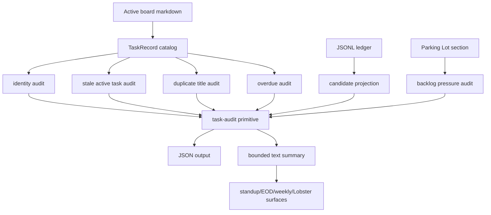

<!-- markdownlint-disable MD025 -->

# feat: Add periodic task audits

## Summary

Add read-only periodic task audits that surface duplicate active tasks, missing
or unsafe identities, stale active work, stale completion candidates, and backlog
pressure without mutating the task board. The audit should become the next safe
automation layer after the completion inbox: it tells the user and workflows
what needs pruning, freezing, repairing, or review, while preserving canonical
ID-only mutation rules.

---

## Problem Frame

The task-tracker foundation now has canonical IDs, ID-only completion, shared
task records, and a completion evidence inbox. The remaining daily pain is task
buildup: duplicates, stale active items, unresolved candidates, and backlog
items can accumulate silently until standup and weekly review become noisy again.

The audit must not become another task system. It should report and recommend
safe next actions; actual changes still happen through existing explicit
commands such as identity repair, candidate decisions, and canonical ID-based
task transitions.

---

## Requirements

- R1. Provide a `task-audit` primitive that produces deterministic JSON for work
  and personal boards.
- R2. Audit output must include duplicate-title clusters, missing or malformed
  canonical IDs, stale active tasks, overdue tasks, stale completion candidates,
  and backlog or parking-lot pressure.
- R3. Audit output must include concise human-readable summaries suitable for
  standup, EOD, weekly review, and Lobster/OpenClaw cron relay surfaces.
- R4. Audits must be read-only by default and must not mutate the active board,
  daily notes, completion log, or ledger.
- R5. Audit recommendations must name safe existing commands or candidate IDs,
  not title/fuzzy/list-position mutation paths.
- R6. Duplicate detection must treat duplicate titles as review signals, not as
  evidence that tasks are identical or safe to merge.
- R7. Staleness must be explainable: each flagged task should show the basis for
  the age calculation and whether the signal came from task metadata, due date,
  candidate history, or backlog metadata.
- R8. Workflow surfaces must cap audit output and link to or name the full audit
  command when there is overflow.
- R9. The first slice must not add automatic freezing, deletion, merging,
  bulk-confirming, Gmail ingestion, calendar ingestion, or session-log evidence
  ingestion.

---

## Scope Boundaries

- The audit is advisory. It can recommend repair, review, freeze, backlog, or
  candidate decisions, but it must not perform those actions.
- The audit should rely on existing local data: active boards, task records,
  identity audit results, candidate ledger projection, and parking-lot metadata.
- The audit should support work and personal modes without collapsing their
  board or ledger state.
- The audit should not introduce a new persistent audit database in this slice.

### Deferred to Follow-Up Work

- Automatic freeze/backlog/delete/merge actions: future explicit workflow after
  audit recommendations prove useful.
- Session-log extraction into completion candidates: separate ingestion PR after
  audits are visible in daily usage.
- Gmail and calendar evidence ingestion: later source-adapter PRs after local
  audit and candidate loops are reliable.
- A full daily/weekly recap redesign: future UX PR that can consume the audit
  summary once the primitive exists.

---

## Context & Research

### Relevant Code and Patterns

- `scripts/task_records.py` provides the shared `TaskRecord` model, canonical
  identity fields, fallback diagnostics, active-record filtering, and line
  numbers.
- `scripts/task_identity.py` already reports missing, duplicate, and malformed
  task IDs without writing.
- `scripts/candidate_review.py` provides capped read-only completion candidate
  summaries for workflow surfaces.
- `scripts/completion_candidates.py` projects candidate state from the JSONL
  ledger using strict ledger reads.
- `scripts/parking_lot.py` already exposes stale backlog item parsing and JSON
  output.
- `scripts/tasks.py` owns the stable primitive envelope pattern used by
  `standup-summary`, `weekly-review-summary`, `calendar-sync`, and
  `completion-candidates`.
- `scripts/standup.py`, `scripts/eod_review.py`, and `scripts/weekly_review.py`
  already display completion candidate review pointers without completing tasks.
- `tests/test_task_primitives.py`, `tests/test_completion_candidates.py`,
  `tests/test_task_identity.py`, and `tests/test_parking_lot.py` cover the
  safest existing patterns for this work.

### Institutional Learnings

- `docs/solutions/workflow-issues/id-only-task-completion-source-of-truth-2026-05-22.md`
  establishes the source-of-truth boundary: active boards own current state,
  daily/weekly notes are logs or evidence, and the ledger is audit/candidate
  history.
- The same solution note requires wrappers to remain thin and forbids completion
  from title, fuzzy match, fallback ID, quick ID, list position, calendar, Gmail,
  or session evidence.
- `docs/plans/2026-05-21-004-feat-inbox-workflow-consumption-plan.md` shows the
  pattern for adding workflow-visible summaries without adding noisy ingestion
  sources.

### External References

- None. The codebase already has the relevant primitives and safety pattern; the
  main risk is preserving local source-of-truth semantics, not adopting a new
  external framework.

---

## Key Technical Decisions

- **Make the audit a primitive, not a workflow script.** `tasks.py task-audit`
  should be the stable contract; standup, weekly, EOD, Telegram, and Lobster can
  consume it without reimplementing task semantics.
- **Keep audit rows action-oriented but read-only.** Each finding should include
  `severity`, `reason`, `task_id` when safe, `fallback_id` only as diagnostic,
  and `recommended_action` text that points at safe commands.
- **Use severity bands instead of automatic mutation.** For example, missing IDs
  and malformed ledgers can be blocking/high, duplicate titles and stale tasks
  can be review/high or review/medium, and backlog pressure can be warning/low.
- **Compute stale status from explicit evidence only.** Due dates, task metadata,
  candidate timestamps, and backlog stale markers are acceptable. When no
  touched/created metadata exists, mark the basis as unavailable instead of
  inventing an age.
- **Cap workflow summaries.** Daily surfaces should show counts and the top few
  actionable findings, not dump the full audit.

---

## Open Questions

### Resolved During Planning

- Should the audit mutate tasks? No. This slice is read-only by default and
  should only recommend existing safe commands.
- Should Gmail, calendar, or session sources be included? No. Those remain
  deferred until local audit and candidate-review behavior is proven.
- Should duplicates be merged automatically? No. Duplicate titles are ambiguous
  and must be treated as review prompts.

### Deferred to Implementation

- Exact default thresholds for stale active tasks and backlog pressure: choose
  conservative defaults after inspecting current local constants and tests, and
  expose CLI flags or env overrides if they fit existing command style.
- Exact human summary wording: keep it concise and verify with markdown/text
  fixtures; final phrasing can be adjusted during implementation.

---

## High-Level Technical Design

> *This illustrates the intended approach and is directional guidance for
> review, not implementation specification. The implementing agent should treat
> it as context, not code to reproduce.*

---

## Implementation Units

### U1. Audit Data Model and Collector

**Goal:** Add a read-only audit module that collects findings from existing task
records, identity audit data, candidate projection, and parking-lot metadata.

**Requirements:** R1, R2, R4, R6, R7

**Dependencies:** None

**Files:**

- Create: `scripts/task_audit.py`
- Modify: `scripts/task_records.py`
- Test: `tests/test_task_audit.py`

**Approach:**

- Define a small audit result shape with top-level totals, `findings`, and
  `summary`.
- Load `TaskRecord` data using the shared record helpers.
- Reuse `task_identity.audit_payload()` for missing, duplicate, and malformed
  identity signals instead of creating a second identity scanner.
- Group duplicate active task titles by normalized title, but mark them as
  review-only findings.
- Detect overdue tasks from existing due-date data and stale active tasks from
  due date or explicit metadata only.
- Project completion candidates using the existing candidate review/projection
  path and report unresolved, snoozed-expired, and apply-failed candidates.
- Read parking-lot stale data through the existing parking-lot parser or a
  shared helper extracted from it if needed.

**Execution note:** Start characterization-first around current parser and
parking-lot behavior before adding new audit classifications.

**Patterns to follow:**

- `scripts/candidate_review.py` for read-only workflow-safe summaries.
- `scripts/task_identity.py` for identity diagnostics and blocking labels.
- `scripts/task_records.py` for canonical task row shape and fallback-only
  diagnostics.

**Test scenarios:**

- Happy path: board with unique canonical IDs and no stale/candidate/backlog
  issues returns `ok: true`, zero high findings, and stable totals.
- Happy path: duplicate active titles with different task IDs produce one
  duplicate-title finding listing both canonical task IDs.
- Edge case: duplicate title where one task has only a fallback ID reports the
  fallback as diagnostic and does not recommend merge or completion.
- Edge case: task missing `task_id::` is reported via the identity audit path
  with `identity-repair --dry-run` as the recommended safe action.
- Edge case: overdue task with canonical ID appears in overdue findings without
  mutating the board.
- Error path: malformed candidate ledger returns an audit finding or degraded
  section instead of silently dropping candidate history.
- Integration: personal mode reads the personal board and personal ledger only.

**Verification:**

- The audit module can be imported without side effects.
- Tests prove audit collection does not change board, daily note, or ledger
  contents.

### U2. CLI Primitive and JSON Contract

**Goal:** Expose the audit through a stable `tasks.py task-audit` primitive with
JSON output and threshold controls.

**Requirements:** R1, R2, R4, R5, R7

**Dependencies:** U1

**Files:**

- Modify: `scripts/tasks.py`
- Modify: `references/task-primitives-schema-v1.md`
- Modify: `references/commands.md`
- Test: `tests/test_task_primitives.py`
- Test: `tests/test_task_audit.py`

**Approach:**

- Add `task-audit` to the existing primitive envelope style:
  `schema_version`, `command`, `generated_at`, `personal`, `totals`,
  `findings`, and `summary`.
- Support `--json` or make JSON the default if that matches nearby primitives;
  preserve a concise text mode only if it follows existing CLI conventions.
- Add threshold flags such as `--stale-days`, `--candidate-days`, and
  `--backlog-cap` only where they map to existing local concepts.
- Ensure every finding with a mutation recommendation names a safe explicit
  command and never a title/fuzzy/list-position action.
- Return structured degraded output for unavailable optional surfaces.

**Patterns to follow:**

- `cmd_standup_summary()` and `cmd_weekly_review_summary()` in `scripts/tasks.py`
  for primitive envelopes.
- `references/task-primitives-schema-v1.md` for documenting command JSON.

**Test scenarios:**

- Happy path: `tasks.py task-audit` returns `schema_version: v1` and
  `command: task-audit`.
- Happy path: `--personal task-audit` uses the personal task file and does not
  read or write the work ledger.
- Edge case: threshold flags change stale classification without changing task
  contents.
- Error path: malformed ledger exits or reports with the same strictness used by
  completion candidate commands.
- Integration: `task-audit` output includes identity, duplicate, candidate, and
  backlog sections when fixtures contain all four.

**Verification:**

- CLI help describes the audit as read-only.
- JSON shape is documented and covered by tests.

### U3. Human Summary for Daily and Weekly Surfaces

**Goal:** Add capped audit summaries to standup, EOD, and weekly review outputs
so the user sees task buildup before it becomes painful.

**Requirements:** R3, R5, R8

**Dependencies:** U1, U2

**Files:**

- Modify: `scripts/standup.py`
- Modify: `scripts/eod_review.py`
- Modify: `scripts/weekly_review.py`
- Modify: `scripts/tasks.py`
- Test: `tests/test_standup_compact.py`
- Test: `tests/test_task_primitives.py`
- Test: `tests/test_weekly_review.py`

**Approach:**

- Add a compact audit section that shows counts and top findings by severity.
- Include candidate IDs and canonical task IDs where available.
- Use explicit review language such as "review required" or "repair suggested";
  do not phrase findings as completed work.
- Cap daily output more aggressively than weekly output.
- Keep any marker such as `--mark-shown` limited to completion candidates; audit
  display should not create audit events in this slice.

**Patterns to follow:**

- Existing completion candidate sections in `scripts/standup.py` and
  `scripts/weekly_review.py`.
- `candidate_review_summary()` output style for capped review queues.

**Test scenarios:**

- Happy path: standup summary includes audit totals and top finding IDs without
  changing board or ledger files.
- Happy path: weekly review includes a broader audit pointer but does not call
  archive cleanup or candidate confirmation.
- Edge case: no findings produces a short quiet state instead of a noisy empty
  section.
- Edge case: many findings show overflow count and full command pointer.
- Error path: malformed ledger renders a degraded audit warning rather than
  implying there are no candidate issues.

**Verification:**

- Daily and weekly text remains concise.
- Read-only rendering leaves board, daily notes, and ledger unchanged.

### U4. Lobster/OpenClaw Cron Consumption

**Goal:** Let existing Lobster/OpenClaw workflows relay periodic audit summaries
without implementing task semantics outside task-tracker.

**Requirements:** R3, R4, R5, R8

**Dependencies:** U2, U3

**Files:**

- Modify: `README.md`
- Modify: `SKILL.md`
- Modify: `docs/ARCHITECTURE.md`
- Modify: `references/commands.md`
- Modify: `docs/plans/2026-05-21-004-feat-inbox-workflow-consumption-plan.md`
- Test: `tests/test_task_primitives.py`

**Approach:**

- Document the workflow contract for external consumers: call the audit
  primitive, display summary, and route actions through existing explicit
  commands.
- Keep repo-specific cron wiring out of this task-tracker PR unless the
  implementation needs a tiny command wrapper. Lobster-specific schedule changes
  should land in the workflow repo.
- Specify likely cadence in docs: daily lightweight audit in EOD or standup, and
  weekly broader audit during weekly review.
- Make clear that cron jobs must not auto-freeze, auto-delete, auto-merge, or
  auto-confirm from audit output.

**Patterns to follow:**

- `docs/ARCHITECTURE.md` read/write table for command side effects.
- `SKILL.md` command examples and safety contract.
- Prior workflow-consumption plan language around Lobster and Telegram wrappers.

**Test scenarios:**

- Documentation examples invoke `task-audit` and safe follow-up commands only.
- Existing primitive summary tests prove external workflows can consume JSON
  without needing markdown parsing.

**Verification:**

- Docs make the audit cadence and safety boundary clear enough for workflow
  agents.

### U5. Regression and Safety Suite

**Goal:** Prove the audit cannot reopen the title/fuzzy/fallback mutation risks
closed by the prior vNext work.

**Requirements:** R4, R5, R6, R9

**Dependencies:** U1, U2, U3

**Files:**

- Modify: `tests/test_task_audit.py`
- Modify: `tests/test_task_primitives.py`
- Modify: `tests/test_completion_candidates.py`
- Modify: `tests/test_task_identity.py`
- Modify: `tests/test_parking_lot.py`

**Approach:**

- Add fixture-backed tests around mixed unsafe conditions: duplicate title,
  missing ID, fallback-only task, stale candidate, and backlog pressure.
- Snapshot before and after audit commands to prove no unintended writes.
- Include explicit negative assertions that audit output does not expose title,
  fuzzy, fallback, quick ID, local numeric ID, or list position as mutation
  targets.
- Preserve work/personal isolation tests.

**Patterns to follow:**

- Existing before/after mutation assertions in `tests/test_completion_candidates.py`.
- Existing duplicate-title primitive tests in `tests/test_task_primitives.py`.

**Test scenarios:**

- Integration: running `task-audit`, standup, EOD, and weekly summary on the same
  fixture causes no board, daily-note, or ledger mutation.
- Error path: malformed ledger blocks or degrades audit candidate reporting
  without hiding the identity and duplicate findings that can still be computed.
- Edge case: duplicate title cluster with one canonical ID and one fallback-only
  row is review-only and not mergeable.
- Edge case: stale snoozed candidate appears actionable again without changing
  candidate status.
- Error path: audit recommendations never include `tasks.py done "title"` or
  any local numeric parking-lot ID as a canonical mutation path.

**Verification:**

- Focused audit, primitive, identity, candidate, and parking-lot tests pass.
- Public hygiene and markdownlint pass for changed docs.

---

## System-Wide Impact

- **Daily workflow:** Standup/EOD can show small task-health warnings before the
  board becomes unmanageable.
- **Weekly review:** Weekly output can separate "work completed" from "task
  system cleanup needed."
- **Agent safety:** Agents get explicit audit findings and safe repair/review
  actions instead of inferring from titles or stale checked boxes.
- **Workflow integration:** Lobster/OpenClaw can relay audit summaries without
  owning task parsing or task mutation.
- **State lifecycle risks:** The audit introduces no new active state; it reads
  board, ledger, and backlog state and emits findings.
- **Unchanged invariants:** Active board markdown remains current task state;
  daily/weekly notes remain logs; ledger remains audit/candidate history; task
  completion remains ID-only.

---

## Risks & Dependencies

- Audit becomes another task system: keep it read-only and avoid any new
  persistent audit database in this slice.
- Stale logic invents false certainty: include `basis` fields and mark
  unavailable age data explicitly.
- Duplicate detection encourages unsafe merges: treat duplicate titles as
  review-only and never as merge authority.
- Daily summaries become noisy: cap output and put full detail behind
  `task-audit`.
- Workflow scripts bypass command contract: document and test that consumers
  call `task-audit` and existing explicit commands only.
- Work/personal data leaks across modes: reuse existing `--personal` patterns
  and add isolation tests.

---

## Phased Delivery

1. Build the read-only audit collector and tests.
2. Expose the `task-audit` primitive and schema docs.
3. Add capped standup/EOD/weekly audit summaries.
4. Update docs for Lobster/OpenClaw cron consumption and safe cadence.
5. Expand regression tests around no mutation, duplicate titles, fallback-only
   IDs, malformed ledger, and work/personal isolation.

---

## Documentation Plan

- Update `README.md`, `SKILL.md`, and `references/commands.md` with `task-audit`
  usage and the read-only contract.
- Update `references/task-primitives-schema-v1.md` with the audit JSON shape.
- Update `docs/ARCHITECTURE.md` with audit read/write behavior.
- Update the prior workflow-consumption plan to note that periodic audits are
  the next automation layer before source ingestion.

---

## Verification Strategy

- Focused tests for `tests/test_task_audit.py`.
- Primitive regression tests in `tests/test_task_primitives.py`.
- Candidate and identity regression coverage where audit consumes those
  surfaces.
- Standup, EOD, and weekly summary checks proving capped audit visibility and no
  mutation.
- Public hygiene, markdownlint, and CLI help checks for the new command.

---

## Sources & References

- `docs/solutions/workflow-issues/id-only-task-completion-source-of-truth-2026-05-22.md`
- `docs/plans/2026-05-20-001-refactor-pr108-identity-kernel-split-plan.md`
- `docs/plans/2026-05-21-003-feat-completion-evidence-inbox-plan.md`
- `docs/plans/2026-05-21-004-feat-inbox-workflow-consumption-plan.md`
- `docs/ARCHITECTURE.md`
- `references/task-primitives-schema-v1.md`
- `references/commands.md`
- `SKILL.md`
