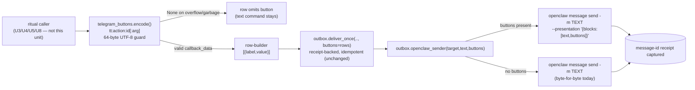

# feat: U1 — Outbound button presentation on the receipt-backed sender (plan)

**Date:** 2026-06-22 · **Depth:** Standard · **Type:** feat
**Origin:** `~/projects/tools/cos-build/goals/v0.3-work-ritual-consolidation-plan.md` §"U1. Outbound button presentation on the receipt-backed sender" — the WHAT/HOW for the v0.3 inline-button seam.
**Target repo:** `task-tracker` (this repo). Worktree: branch `feat/v0.3-u1` off `origin/main`.
**Build discipline:** one squash-merge PR, `<1000` LOC, tests per the U1 Test scenarios, public-repo chat-id hygiene (fake `-4242424242` only).

---

## Summary

Give the existing receipt-backed outbox sender the ability to attach inline Telegram
action buttons to a message **without changing any v0.2 delivery guarantee**
(idempotency, receipt capture, delivery-target proof). This is the send half of the
v0.3 inline-button seam (the receive half — gateway plugin + dispatcher — is U2).

Two pieces:
1. A new `scripts/telegram_buttons.py` — a `callback_data` codec (`encode`/`decode`)
   for the `tt:<action>:<task_id>[:<arg>]` scheme with a hard 64-byte UTF-8 guard,
   plus row-builders for the KTD-3 button sets.
2. A surgical extension of `scripts/outbox.py` — `openclaw_sender` and `deliver_once`
   gain an optional `buttons` argument; when present, `openclaw_sender` emits
   `openclaw message send --presentation '<json>'` carrying a `MessagePresentation`
   text + buttons block. The no-buttons path is byte-for-byte today's behavior.

---

## Problem Frame

**Invariant:** a button message is a *normal receipted send with an extra presentation
block* — it must reuse the exact `deliver_once` idempotency + receipt-recording barrier
and the `openclaw_sender` subprocess discipline (list-form args, never `shell=True`,
never a fabricated receipt). The button machinery is pure transport; it adds no new
delivery path, no auth, and no board mutation.

Telegram caps `callback_data` at 64 UTF-8 **bytes**. The codec must count bytes (not
characters) and, when a value would overflow, return `None` so the row-builder omits
that button and the caller's existing text command stays in the message body (graceful
degradation — mirrors `dialpad/webhook_server.py:build_telegram_callback_data`).

---

## Requirements

Traced to the origin plan §U1 (R5 native inline-button UX, R6 inherit v0.2 guarantees).

- **R5** — Outbound buttons on the receipt-backed sender, consumed later by every ritual.
- **R6** — Every v0.2 guarantee (receipt-backed idempotent send, delivery-target proof,
  no fabricated receipt) is preserved unchanged.

**Success criteria:** `encode`/`decode` round-trip the KTD-3 scheme; over-budget /
empty / garbage input returns `None`; `openclaw_sender` with buttons shells
`--presentation` with the documented JSON shape and still returns the captured receipt;
the no-buttons path is byte-for-byte unchanged; a sender transport failure still raises
(no fabricated receipt).

---

## Key Technical Decisions

**KTD-A — The codec lives in a new `telegram_buttons.py`, not inside `outbox.py`.**
`outbox.py` owns delivery (idempotency, receipts, subprocess); the `callback_data`
scheme and button-row layout are a distinct concern reused by the nag, EOD, and standup
(U3/U4/U5/U8). Keeping them separate respects SRP and lets U2's dispatcher import the
same `decode` without pulling in the outbox. *Rationale:* one source of truth for the
`tt:` scheme on both the send and receive sides.

**KTD-B — `encode` returns `None` on overflow/garbage; the row-builder drops that button.**
Mirrors the proven `dialpad` pattern: validate byte length, return `None` rather than
raise, and have the builder omit the button so the message still sends with its text
command intact. *Rationale:* a button that cannot be encoded must degrade silently, never
crash a delivery or emit a malformed `tt:` value the gateway would mis-route.

**KTD-C — Buttons map to a `MessagePresentation` text+buttons block; `callback_data`
goes in each button's `value` field.** Per the openclaw `--presentation` contract
(`docs/plugins/message-presentation.md`): `{"blocks":[{"type":"text","text":<msg>},
{"type":"buttons","buttons":[{"label":..,"value":<callback_data>}]}]}`. The CLI flag is
`--presentation <json>`. *Rationale:* the documented portable contract; Telegram renders
the `value` as inline-keyboard `callback_data`.

**KTD-D — `openclaw_sender` keeps `-m <text>` AND adds `--presentation` when buttons are
present.** The plain-text `-m` body remains the fallback the channel degrades to; the
presentation block layers the buttons on top. When `buttons` is absent/empty, the argv
is byte-for-byte today's (no `--presentation` flag at all). *Rationale:* preserves the
exact current behavior for every existing caller (nag, check-in, ledger) — U1 is purely
additive.

---

## High-Level Technical Design



*Directional guidance.* The codec + row-builders are new; the delivery barrier and
subprocess discipline are reused unchanged. `deliver_once` threads `buttons` through to
the injected `sender` — it does **not** add buttons to the idem-key (a button message and
its text-only twin for the same logical send are the same delivery).

### `callback_data` scheme (KTD-3)

| Action | callback_data | Builder |
|---|---|---|
| Mark done | `tt:done:<task_id>` | `done_row` / disposition |
| Snooze 1d | `tt:snz:<task_id>:1d` | nag |
| Reschedule (open) | `tt:rsch:<task_id>` | nag, EOD |
| Reschedule to date | `tt:rsch:<task_id>:<YYYY-MM-DD>` | date-option row |
| Carry | `tt:carry:<task_id>` | EOD disposition |
| Drop | `tt:drop:<task_id>` | EOD disposition |
| Confirm completion | `tt:appr:<task_id>` | EOD confirm |
| Set tomorrow #1 | `tt:top:<task_id>` | EOD |

`encode` rejects (returns `None`) any value over 64 UTF-8 bytes, an empty/garbage action,
or an empty/garbage task_id.

---

## Output Structure

```
task-tracker/
  scripts/
    telegram_buttons.py        # NEW — callback_data codec + row-builders
    outbox.py                  # MODIFIED — optional buttons arg on sender + deliver_once
  tests/
    test_telegram_buttons.py   # NEW
    test_outbox.py             # EXTENDED
```

---

## Scope Boundaries

**In scope:** the `callback_data` codec, the KTD-3 row-builders, the byte guard + drop
fallback, and the `openclaw_sender`/`deliver_once` `--presentation` extension with its
tests.

### Deferred to Follow-Up Work
- The gateway interactive plugin + callback dispatcher that consume `decode` (U2).
- Wiring buttons onto the nag (U3), EOD (U4/U5), and standup (U8).
- The `selects` UI and date-picker layout tuning.

---

## Implementation Units

### U1. Outbound button presentation on the receipt-backed sender

**Goal:** the existing sender can attach inline action buttons to a Telegram message
without changing its idempotency/receipt guarantees.
**Requirements:** R5, R6.
**Dependencies:** none.
**Files:** `scripts/telegram_buttons.py` (new), `scripts/outbox.py` (extend
`openclaw_sender` + `deliver_once` with an optional `buttons` arg),
`tests/test_telegram_buttons.py` (new), `tests/test_outbox.py` (extend).
**Approach:**
- `telegram_buttons.py` exposes:
  - `NAMESPACE = "tt"`, `MAX_BYTES = 64`, and a frozen set of known actions
    (`done`, `snz`, `rsch`, `carry`, `drop`, `appr`, `top`).
  - `encode(action, task_id, arg=None) -> str | None`: builds
    `tt:<action>:<task_id>[:<arg>]`, validates the action is known and `task_id`/`arg`
    are non-empty and contain no `:` (the field separator); returns `None` on any
    failure or when the UTF-8 byte length exceeds `MAX_BYTES`.
  - `decode(data) -> tuple[str, str, str | None] | None`: inverse; splits on the first
    three `:` boundaries (`namespace`, `action`, `task_id`, optional `arg`), validates
    the namespace and action, returns `(action, task_id, arg)` or `None`.
  - Row-builders for the KTD-3 sets (e.g. `done_button`, `snooze_button`,
    `reschedule_button`, `reschedule_date_buttons`, `carry_button`, `drop_button`,
    `approve_button`, `set_top_button`) that return `[{"label","value"}]` button dicts,
    omitting any button whose `encode` returned `None`. A higher-level helper assembles
    a `buttons` list a caller passes straight to `deliver_once`.
- `outbox.py`:
  - `openclaw_sender(delivery_target, text, buttons=None)`: when `buttons` is a
    non-empty list, build a `MessagePresentation` dict
    `{"blocks":[{"type":"text","text":text},{"type":"buttons","buttons":buttons}]}`,
    `json.dumps` it, and append `--presentation <json>` to the existing argv; otherwise
    the argv is unchanged from today. Still list-form, never `shell=True`, still
    `_extract_message_id` on stdout, still raises `OpenclawSendError` on any failure.
  - `deliver_once(..., buttons=None)`: thread `buttons` to `sender(delivery_target,
    text, buttons)`. The idem-key is unchanged (buttons are not part of delivery
    identity). The injected `sender` signature gains the optional 3rd positional arg;
    fake senders in tests accept it.
**Patterns to follow:** `dialpad/webhook_server.py:build_telegram_callback_data` (byte
guard + `None` drop), the existing `openclaw_sender` subprocess discipline in
`scripts/outbox.py` (list-form args, no `shell=True`, no fabricated receipt), and the
`test_outbox.py` fake-sender / stubbed-`subprocess.run` fixtures.
**Execution note:** extend `test_outbox.py` with a characterization assertion that the
no-buttons argv is byte-for-byte unchanged before adding the buttons branch, so the
additive change is proven not to perturb the existing path.
**Test scenarios:**
- Happy path (codec): `encode("done","tsk_abc")` → `"tt:done:tsk_abc"`, and
  `decode` of it → `("done","tsk_abc",None)`; `encode("rsch","tsk_abc","2026-06-24")`
  → `"tt:rsch:tsk_abc:2026-06-24"`, `decode` → `("rsch","tsk_abc","2026-06-24")`.
- Edge (over-budget): a `task_id` long enough to push the value past 64 UTF-8 bytes →
  `encode` returns `None`; the corresponding row-builder omits that button and any
  sibling buttons stay. Covers the drop-fallback.
- Edge (multibyte): a value at the byte boundary with a multibyte char counts **bytes**
  not chars — a string of 63 chars that is 65 bytes is rejected.
- Edge (empty/garbage): `encode("","tsk_x")`, `encode("done","")`,
  `encode("done",None)`, `encode("bogus","tsk_x")` (unknown action), and a `task_id`/
  `arg` containing `:` all return `None` (never a malformed `tt:` value).
- Edge (decode garbage): `decode("")`, `decode("rw:done:x")` (wrong namespace),
  `decode("tt:bogus:x")` (unknown action), `decode("tt:done")` (too few parts) → `None`.
- Integration (buttons send): `openclaw_sender(TARGET, "txt", buttons=[{"label":"Done",
  "value":"tt:done:tsk_abc"}])` (stubbed `subprocess.run`) → argv contains
  `--presentation`; the JSON parses to the expected `{blocks:[text,buttons]}` shape with
  the `callback_data` in `value`; targets `TARGET["chat_id"]`/`topic_id`; returns the
  captured `{"message_id": ...}`.
- Integration (no-buttons unchanged): `openclaw_sender(TARGET, "txt")` and
  `openclaw_sender(TARGET, "txt", buttons=None)` produce an argv with **no**
  `--presentation` and identical to the pre-U1 argv (byte-for-byte).
- Integration (`deliver_once` threads buttons): `deliver_once(..., buttons=rows,
  sender=fake)` calls the fake sender with `rows` as the 3rd arg and records one receipt;
  a same-key re-fire returns the recorded receipt without re-calling the sender (buttons
  do not change the idem-key).
- Error path: stubbed `subprocess.run` non-zero exit / unparseable stdout / missing
  `messageId` with `buttons` present → raises `OpenclawSendError`, records no receipt
  (unchanged failure semantics).
**Verification:** `pytest -q tests/test_telegram_buttons.py tests/test_outbox.py` green;
the full suite green; public-hygiene check exits 0 (no real chat ids); the diff touches
only the four named files and stays well under 1000 LOC.

---

## Risks & Dependencies

- **64-byte budget for future longer args.** Today's `tsk_<16hex>` ids and ISO dates fit
  comfortably; a future composite arg could overflow. The `None`-drop fallback prevents a
  hard failure but degrades UX silently — the codec should make the drop observable to
  callers (the row-builder simply omits the button) so a later unit can log it.
- **Sender signature change.** `deliver_once` passes a 3rd positional to `sender`. Every
  existing caller injects its own `sender`; the production `openclaw_sender` and all test
  fakes must accept the optional arg. Keep it optional with a `None` default so no caller
  breaks.
- **No board mutation / no new auth.** This unit sends only; it must not import or call
  any board-transition or authorization code. (Verified by scope: the only modified
  non-test file is `outbox.py`.)

---

## Sources & Research

- **Origin:** `~/projects/tools/cos-build/goals/v0.3-work-ritual-consolidation-plan.md`
  §U1, KTD-1, KTD-3.
- **Sender to extend:** `scripts/outbox.py` (`openclaw_sender`, `deliver_once`,
  `_extract_message_id`, `OpenclawSendError`).
- **Byte-guard pattern:** `skills/work/dialpad/scripts/webhook_server.py:build_telegram_callback_data`.
- **Presentation contract:** openclaw `docs/plugins/message-presentation.md`
  (`MessagePresentation` = `{title?, tone?, blocks:[...]}`; buttons block
  `{type:"buttons",buttons:[{label,value,...}]}`; CLI flag `--presentation <json>`).
- **Test fixtures to mirror:** `tests/test_outbox.py` (fake sender, stubbed
  `subprocess.run`, `TARGET` with fake chat id `-4242424242`).
